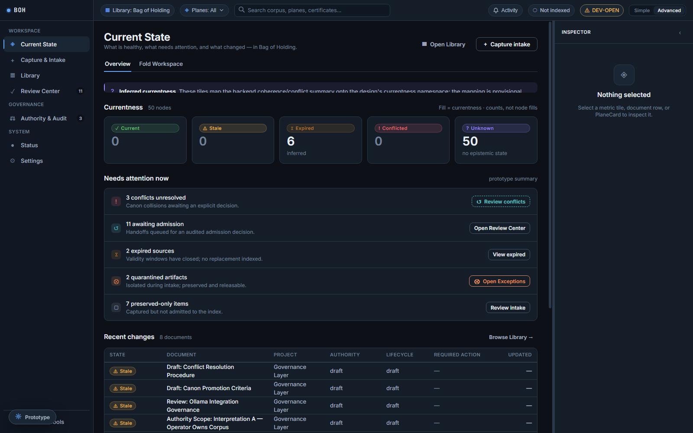
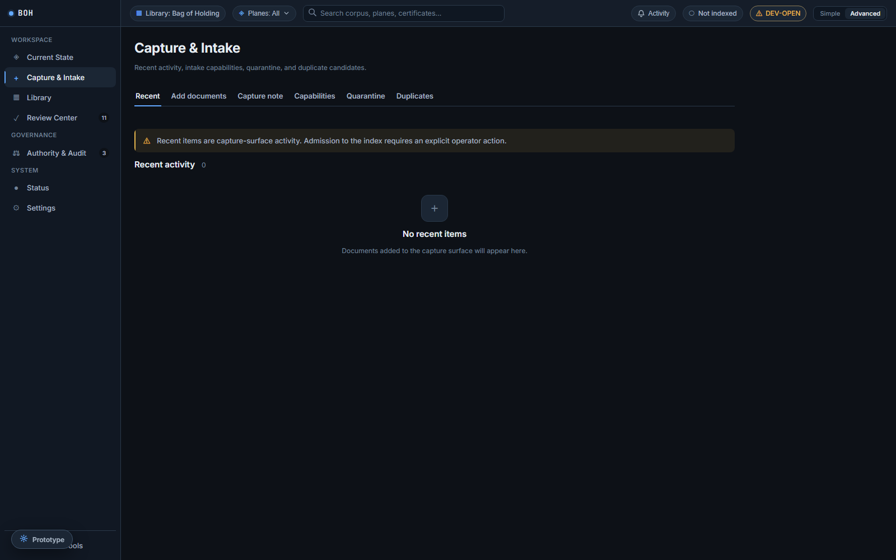
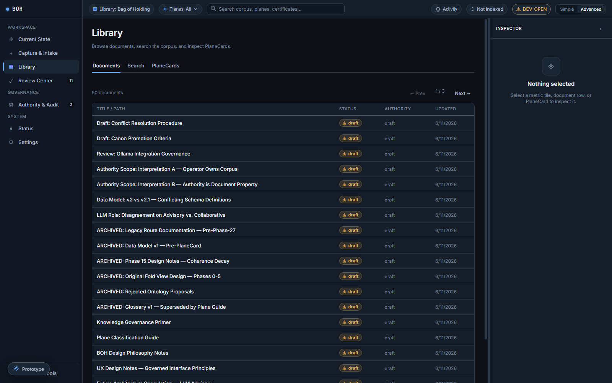
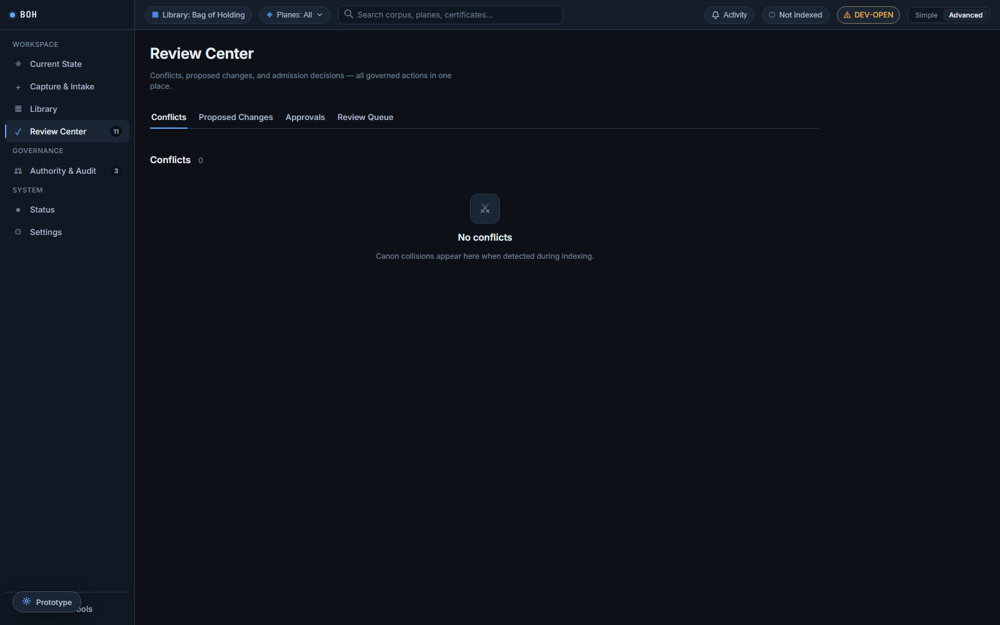
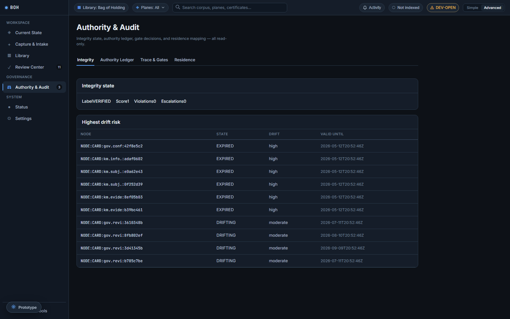
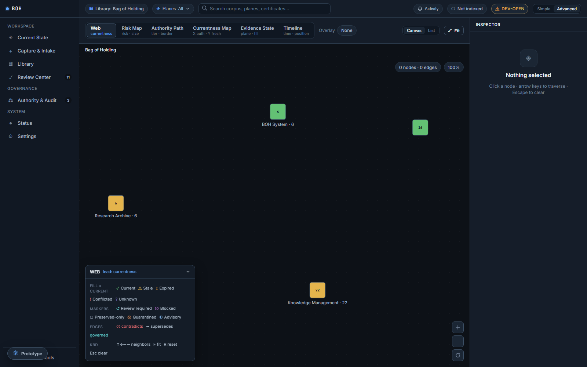
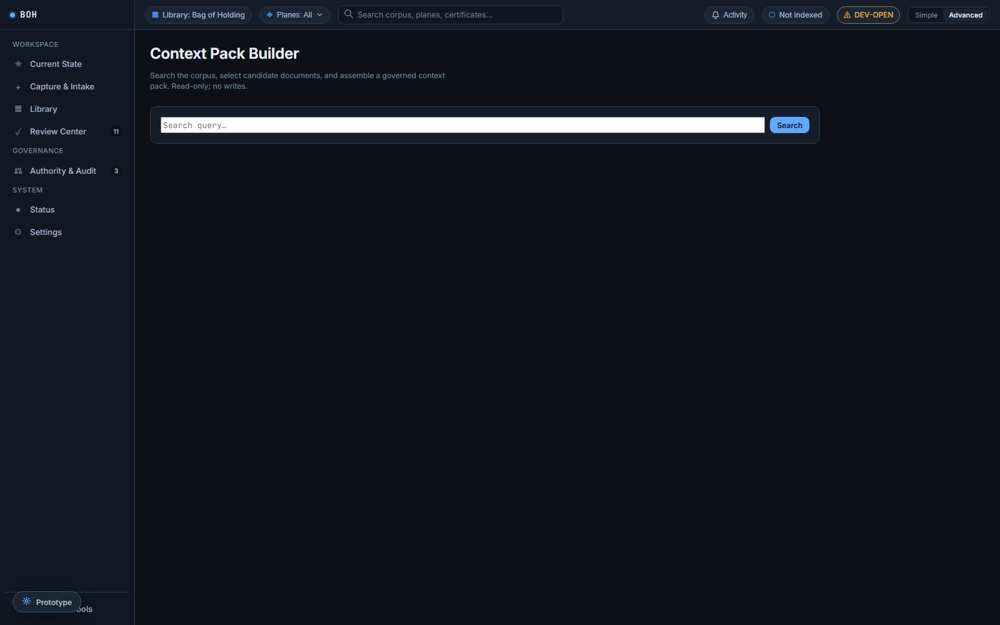
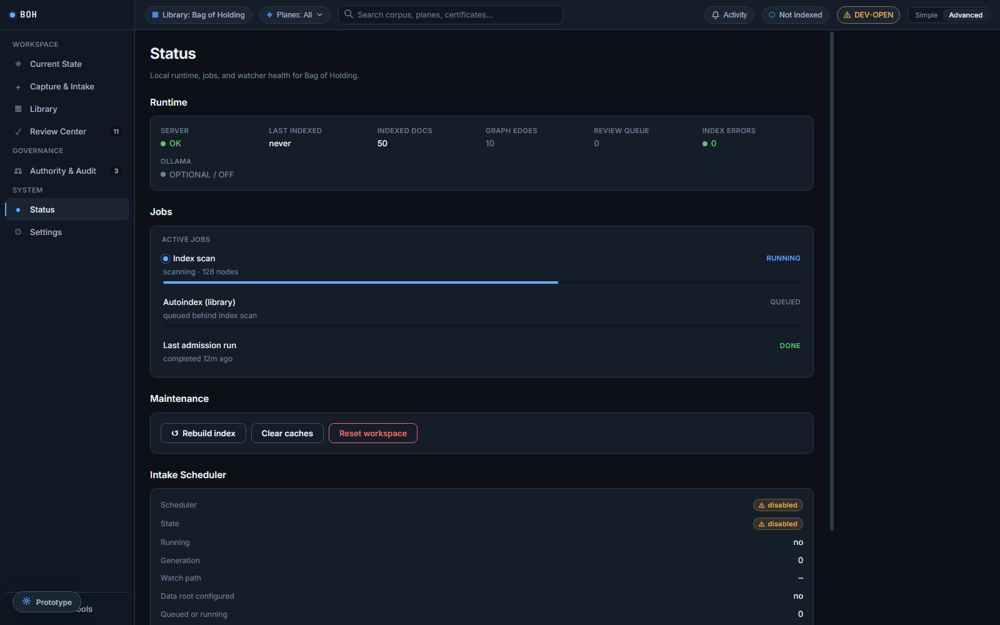

# Bag of Holding

> **Governed dimensional storage for durable reasoning.**

[](https://github.com/ppeck1/Bag-of-Holding/actions/workflows/tests.yml)

**Status: public alpha source release. Local development and evaluation only.**

Bag of Holding is a local-first knowledge workbench for people who care not just about storing information, but about knowing where it came from, what it connects to, and whether it can be trusted.

It is built around a simple but demanding premise: *reasoning should be durable*. Documents carry provenance. Authority transfers require explicit approval. LLM outputs are proposals, not facts. Canonical truth is earned, not inferred.

New to the project's vocabulary (CANON, PlaneCards, Fold, Daenary, Metis…)? Start with the [one-screen glossary](docs/GLOSSARY.md).

---

## Current Status

**LLM proposes. Human governs. System audits.**

BOH is a local-first knowledge workbench in active development. The primary UI is now the new governed interface served at `/` — launch with `python launcher.py` and the browser opens there automatically. The classic UI is preserved at `/classic` (deprecated; for rollback), and `/v2/` remains a backward-compatible alias for the governed UI.

### New governed UI (served at `/`)

A build-free vanilla ES module SPA. No build step, no framework, no external JS dependencies at runtime. All screens are wired to live API endpoints.

#### Top bar

| Control | Behaviour |
|---------|-----------|
| `▦ Library: Bag of Holding` | Static identity chip — single private-memory store |
| `◈ Planes: All / N / None` | Interactive plane-visibility popover — toggles 8 planes (Informational, Subjective, Evidence, Internal, Review, Canonical, Conflict, Archive). Affects Library PlaneCards tab and Fold Workspace node visibility only. Retrieval, authority, and intake are unchanged. |
| Global search | Deep-links to Library → Search tab with query pre-filled |
| Mode toggle | Simple / Advanced — gates `adv-only` columns |

#### Screens

| Screen | Key features |
|--------|-------------|
| **Current State** | Currentness tiles (current/stale/expired/conflict/unknown), recent-changes table, system status; tile or row click opens Inspector |
| **Fold Workspace** | Force-directed SVG graph; 6 projections (Web, Risk Map, Authority Path, Currentness Map, Evidence State, Timeline); cluster expand/collapse; keyboard nav; hover non-destructive; zoom 240–700%; project cluster labels show filtered vs total when Planes filter is active |
| **Library** | Paginated Documents tab, full-text Search tab, PlaneCards tab (filtered by Planes selector); row click opens shared Inspector with lazy doc enrichment; PlaneCard click opens dedicated card Inspector branch |
| **Review Center** | Conflicts, LLM proposals (governed admit/reject with operator token), approval ledger, review queue |
| **Authority & Audit** | Integrity dashboard, authority ledger, trace events (accordion), residence map |
| **Capture & Intake** | Recent activity, capabilities, quarantine (containment hold/release), duplicates |
| **Settings** | 6 groups: General, Library & Indexing, Intake Automation, AI & Analysis, Visualization, Security & Advanced |
| **Status** | Runtime cells, scheduler/watcher section, maintenance actions |
| **Activity Log** | Deterministic audit stream; corpus and audit JSON export |
| **Context Pack** (Advanced) | Search → select → assemble context pack via `/api/context-pack/assemble` |

#### Inspector panel

Shared right-side panel across Current State and Library.

- **Document selection** — shows title, project, status, authority, summary, definition count, event count. Enriched lazily from `GET /api/docs/{id}` with a stale-selection guard.
- **PlaneCard selection** — dedicated card branch: plane, card type, topic, b/d/m, valid until, backing doc.
- **Metric selection** — currentness namespace metadata, delta.
- **Collapse** `‹` — dismisses panel, content reclaims full width.
- **Drag resize** — 240–700 px on desktop; below 1280 px the panel becomes a fixed overlay and resize is intentionally disabled.

### Backend

- **Governed ingestion & translation layer** (Phases 1–8): full pipeline from file discovery → stabilization → preservation → translation routing → normalization → queryability → interpretation → governance handoff → DB persistence.
- **Intake orchestration integrity** (WO-1, Gate C4 CLOSED — PASS): idempotent, bounded, atomic, auditable, lifecycle-safe intake shared by manual/replay/scheduler paths. Frozen `srid-v1` source-revision identity; atomic claim-lease state machine; transaction-aware writer; managed scheduler (`start_if_enabled`/`stop`/`status`). Forward migration `0001_intake_orchestration_integrity`.
- **Scheduler operational hardening** (WO-1.1, Phase A+B complete): ledger-authoritative byte-binding; crash-safe registry reconciliation; root-overlap rejection; generation-safe stop/restart; deterministic adapter-registry fingerprint (`adapterfp-v1:`) in revision identity; policy-binding consistency; strict replay vs explicit reprocess; scheduler status on `GET /api/status`; fail-closed config validation.
- **Current Fold View** (Phases 0–7c): `CurrentFoldPacket` resolver, dual-channel cluster/corpus aggregation engine, read-only project/plane/domain/batch cluster routes, `scale_actions[]` roll-up axes.
- **CANON scalar bridge** (complete): six derived policy variables (`drift_rate`, `entropy`, `delta_c_star`, `gamma`, `omega_viability`, `mismatch_gradient`) bridged into the Fold contract; graph/fold numeric parity enforced.
- **Metis retrieval contract v0.1**: citation URIs (`boh://{doc_id}#{chunk_id}`), source spans, top-level warnings on `/api/retrieve`.
- **Retrieval roadmap L1–L6** (complete 2026-06-11): provenance/state blocks (`review_state`, `freshness`, `intake_provenance`) on `/api/retrieve` context packs (L2); governed intake→retrieval promotion bridge (WO-2, migration `0002`); read-only `/api/context-object` assembler with grounded blockers (L3), question-type dispatch (L4), context-object assembly (L5), and node-scope fold-neighborhood traversal (L6). See "Read-Only Retrieval Connector" below.
- **Versioned migration architecture**: `init_db()` schema is the immutable `0000_baseline`; `schema_migrations` ledger governs all forward changes (transactional, interrupted-safe, WAL-safe `VACUUM INTO` backup).
- **Planar Gate** metadata and correction-ledger core.

> **Note on intake↔retrieval:** the governed-intake pipeline lands content in the `intake_*` tables; a governed promotion bridge (WO-2, migration `0002`: `intake_handoffs`, `intake_promotions`) can promote completed intake revisions into the retrieval corpus through the operator-gated `/api/intake/promote` and demote routes. Promoted docs are mutation-isolated and **excluded from retrieval by default** — they surface only when the server gate `BOH_RETRIEVAL_INCLUDE_PROMOTED=true` **and** the per-request `include_promoted` flag are both set (dual gate, fail-closed). The intake scheduler is **inert** by default — manual/process-scoped activation only, no persistent daemon.

### Security defaults

- `BOH_LIBRARY` is the server-owned document authority; caller roots are rejected.
- Protected routes (reset, seed, admin, governance mutations) require `BOH_OPERATOR_TOKEN`.
- Retrieval connectors use a separate `BOH_RETRIEVAL_TOKEN`; they never receive the operator token.
- Dev-open mode when `BOH_OPERATOR_TOKEN` is unset (one-time warning; DEV-OPEN badge in UI).
- Actor identity and operator authorization are separate concepts.

BOH is ready for local development and GitHub source publication. Runtime corpus data, SQLite databases, quarantine files, generated review artifacts, and local handoff notes should stay out of commits.

## What Problem Does This Solve?

Most knowledge tools help you find information.  
Bag of Holding helps you *defend* it.

It is designed for situations where silent drift is dangerous:

- LLM-assisted writing and document synthesis
- Research, policy, and compliance work
- Technical documentation and systems design
- Long-running projects with many contributors or versions
- Any corpus where "what is currently true" matters operationally

---

## Screenshots

### Governed UI (`/`) — current interface

Captured 2026-06-11 against a seeded demo library (50 documents, 8 planes, 4 projects).

#### Current State



The landing workspace. Currentness chips summarize the corpus (current / stale / expired / conflicted / unknown), "Needs attention now" surfaces governed actions, and Recent changes lists the latest indexed documents with status, authority, and project.

#### Capture & Intake



The capture surface: add documents or notes, inspect intake capabilities, quarantine, and duplicate candidates. The banner states the invariant — admission to the index requires an explicit operator action.

#### Library



The indexed document registry with Documents, Search, and PlaneCards tabs. Each row shows status, authority, and update time; the Inspector pane enriches the selected document.

#### Review Center



Conflicts, proposed changes, approvals, and the review queue — all governed decisions in one place. No auto-resolution: canon collisions appear here and wait for an explicit decision.

#### Authority & Audit



Read-only integrity state, authority ledger, trace & gates, and residence mapping. The "Highest drift risk" table ranks nodes by drift state and validity window.

#### Fold Workspace



The Fold Workspace renders six resolver-backed projections — Web (currentness), Risk Map, Authority Path, Currentness Map, Evidence State, and Timeline — over project clusters, with a marker legend and keyboard traversal.

#### Context Pack Builder



Read-only assembly surface for governed context packs: search the corpus, select candidates, and build a cited pack. The same capability is exposed to LLM consumers via `/api/retrieve` and `/api/context-object`.

#### Status



Local runtime health: indexed docs, graph edges, review queue, index errors, job states, maintenance actions, and the intake scheduler block (inert by default).

The previous-generation classic UI remains available at `/classic` (deprecated; kept for rollback).

---

## What BOH Is Not

| Tool | Strength | What it lacks |
|------|----------|---------------|
| **Obsidian** | Personal cognition and note-linking | Governance, auditability, canonical enforcement, constrained LLM |
| **Notion** | Collaboration and presentation | Strict lifecycle control, provenance enforcement, review-safe mutation |
| **Jupyter** | Execution and experimentation | Long-term canonization, cross-document governance, decision lineage |
| **Git** | Code version control | Semantic conflict detection, document lifecycle, knowledge governance |
| **BOH** | **Operational cognition + institutional memory** | — |

---

## System Philosophy

**LLM proposes. Human governs. System audits.**

BOH treats language models as assistants, not authorities.

The model **may**:
- summarize and classify documents
- suggest relationships and topics
- detect possible conflicts
- propose metadata and lifecycle state
- generate review artifacts

The model **may not**:
- silently overwrite canonical files
- auto-promote documents to canon or Trusted Source
- bypass operator review
- apply any change without explicit user approval

This is not a safety limitation. It is the architectural principle.

Epistemic integrity requires that *humans own the canon*. BOH enforces this at the data layer.

---

## Core Invariants (never violated)

- **Local-first** — SQLite + filesystem. No cloud dependency.
- **Deterministic scoring** — same inputs always produce same outputs. All formulas in `docs/math_authority.md`.
- **No silent canon overwrite** — canonical documents cannot be replaced without explicit workflow action.
- **No auto-resolution** — conflicts surface and remain until explicitly addressed.
- **LLM artifacts non-authoritative** — proposals go to review queue only; `non_authoritative: true` hardcoded.
- **Append-only lifecycle history** — undo and backward moves create new history records, never delete old ones.
- **Duplicates linked, never deleted** — lineage links created; both versions preserved.
- **Rubrix ≠ Daenary** — lifecycle governance and epistemic state are separate, non-overlapping systems.
- **Server startup never blocked** — auto-index and Ollama failures are caught, logged, and reported; server always boots.
- **Authority transitions require certificates** — no governance state change without a hash-signed certification record.

---

## Quickstart

```bash
cd Bag-of-Holding
pip install -r requirements.txt
python launcher.py
```

Opens at `http://127.0.0.1:8000` automatically.

**Windows:** double-click `launcher.bat`  
**macOS / Linux:** `chmod +x launcher.sh && ./launcher.sh`

**Optional environment variables:**

```bash
BOH_LIBRARY=./library          # path to your document library
BOH_DB=boh.db                  # SQLite database path
BOH_OPERATOR_TOKEN=change-me-local  # required for protected local actions
BOH_RETRIEVAL_TOKEN=change-me-readonly # read-only token for /api/retrieve and /api/context-object connectors
BOH_RETRIEVAL_INCLUDE_PROMOTED=false   # server half of the dual gate exposing promoted intake docs to retrieval
BOH_AUTO_INDEX=true            # scan and index on startup (default: false)
BOH_AUTO_INDEX_MAX_FILES=5000  # startup scan cap
BOH_OLLAMA_ENABLED=true        # enable LLM review queue
BOH_OLLAMA_URL=http://localhost:11434
BOH_OLLAMA_MODEL=llama3.2
BOH_OLLAMA_MAX_CONTENT=20000   # maximum content sent to Ollama
BOH_DETERMINISTIC_REVIEW_ON_INDEX=true
BOH_LLM_REVIEW_ON_INDEX=false
BOH_ANALYZE_ON_INDEX=false

# Governed Intake Layer (all optional; defaults disable the scheduler)
BOH_DATA_ROOT=./data               # required for intake preservation/normalization
BOH_INTAKE_SCHEDULER_ENABLED=true  # enable background file scanner (default: false)
BOH_WATCH_PATH=./watch             # directory to scan when scheduler is enabled
BOH_INTAKE_BACKPRESSURE_MAX=10     # max concurrent in-flight intake runs
BOH_INTAKE_SCAN_INTERVAL=30        # seconds between watch-path scans
BOH_INTAKE_IGNORE_PATTERNS=vault.db # comma-separated discovery ignore patterns; no-op if unset/blank
BOH_INTAKE_DRAIN_TIMEOUT=30        # bounded drain timeout for scheduler stop() (validated 0.001-3600)
```

The scheduler **validates its configuration and fails closed before starting** on an invalid scan
interval (`1-86400`), capacity (`1-4096`), drain timeout (`0.001-3600`), malformed ignore patterns,
an absent/nondeterministic adapter fingerprint, inconsistent policy binding, or an
unsafe/uncreatable/unwritable/overlapping watch/data/library/DB layout. Its live status (enabled,
state, generation, watch path, counts, last scan, last error, drain state, restart-refusal reason)
is exposed read-only under `intake_scheduler` in `GET /api/status` and rendered on the Status screen.

> **Operational pairing (watched corpus):** when activating the scheduler against a real corpus,
> `BOH_WATCH_PATH` (e.g. `<watch-root>`) and `BOH_INTAKE_IGNORE_PATTERNS` **must be kept together**
> — choose a watch root narrow enough to exclude redundant sibling copies of the corpus, and use
> the ignore pattern to keep generated, non-authoritative files (e.g. a generated SQLite index)
> out of the intake ledger. Activating with only one of the two would change the ingested set.

Auto-index is **off by default**. Enable it explicitly when your library is ready.

### Local Operator Authorization

Protected local actions fail closed unless `BOH_OPERATOR_TOKEN` is set before launch.

PowerShell:

```powershell
$env:BOH_OPERATOR_TOKEN="change-me-local"
python launcher.py
```

macOS / Linux:

```bash
export BOH_OPERATOR_TOKEN="change-me-local"
python launcher.py
```

In the browser, enter the same token in the Operator token field and save it for the current tab. BOH sends it as `X-BOH-Operator-Token` on protected requests.

The operator token is not an identity. It is the local permission boundary. Actor identity is carried separately as `X-BOH-Actor-ID`, defaulting to `local_operator`, and is recorded in the actor authority ledger for attribution.

### Read-Only Retrieval Connector

LLM and external retrieval connectors should not receive the operator token. Use a separate read-only retrieval token:

PowerShell:

```powershell
$env:BOH_RETRIEVAL_TOKEN="change-me-readonly"
python launcher.py
```

macOS / Linux:

```bash
export BOH_RETRIEVAL_TOKEN="change-me-readonly"
python launcher.py
```

Retrieval clients send the token as `X-BOH-Retrieval-Token`. The retrieval API returns ranked context packs with chunk IDs, document IDs, title, relative path, snippet, byte/token span, lifecycle state, authority state, provenance, conflicts, lineage, citation metadata, selection reasons, and `do_not_treat_as_canonical` warnings where applicable.

The LLM review queue is different from retrieval. `POST /api/llm/queue` creates a persistent advisory proposal and ledger/attribution records, so it requires `X-BOH-Operator-Token`. Queue reads remain inspectable, and approval/rejection remain protected mutations. There is no separate write-capable connector role yet.

Current retrieval implementation:

- Uses chunk-level storage in `doc_chunks` and `doc_chunks_fts`.
- Stores deterministic local hashed embeddings in `doc_chunk_embeddings`.
- Combines FTS, local embedding similarity, lexical fallback, metadata filters, lineage expansion, canon/authority weighting, and conflict penalties.
- Applies the same metadata filters to chunk results and appended PlaneCard packs, including `authority_state`, `status`, `canonical_layer`, `project`, and `chunk_type`.
- Adds experimental Planar Gate metadata: `planar_context_pack` and `gate_result`, including posture, allowed/withheld refs, reasons, required route, trace event type, and context allowed basis.
- Is read-only and separate from operator/admin authority.
- Does not yet use a neural embedding service or expose a dedicated retrieval UI.

#### Context objects — `/api/context-object` (retrieval roadmap L1–L6, complete)

The same retrieval token also guards a governed context-object assembler — deterministic, read-only orchestration over the existing fold resolver, retrieval engine, conflicts table, and promotion ledger. The six roadmap levels:

- **L1 — document retrieval**: the pre-existing ranked context packs on `/api/retrieve`.
- **L2 — provenance/state retrieval**: each context pack carries `review_state`, `freshness`, and `intake_provenance` blocks; conflict entries carry a `resolution_status`.
- **L3 — grounded blockers**: `only=blocking` returns a reduced blocker view — open conflicts and currentness/canon/queryability-blocking unknowns, each with a source reference, never fabricated.
- **L4 — question-type dispatch**: `question_type=historical|operational|authority|exploratory` adds a `question_context` section (historical timeline + supersession chain; open items, active promotions, blocking conditions; review history + certificates; contradiction pairs + neighbors).
- **L5 — context-object assembly**: `GET /api/context-object?scope=doc:{id}|project:{p}|plane:{p}|node:{id}` (POST body for query scopes) returns `scope` (requested/resolved with structured warnings), `state`, `evidence`, `conflicts`, `unknowns`, and advisory `actions` grounded in existing governed endpoints.
- **L6 — fold-neighborhood retrieval**: `scope=node:{id}` traverses **stored** edges only (`doc_edges` + `lineage`, normalized to a verified vocabulary) with `radius` 1–2 and an optional `edge_types` filter; the neighborhood state includes edges, pressure contributors, and authority paths.

Promoted intake documents (WO-2 bridge) are excluded from retrieval by default. Exposure requires a **dual gate**: the server env gate `BOH_RETRIEVAL_INCLUDE_PROMOTED=true` AND the per-request `include_promoted` flag — fail-closed when either is missing. Mutation isolation of promoted docs is gate-independent: only the governed promote/demote/supersession paths may change them.

### Planar Gate + Correction Ledger Fork

The `experimental/planar-storage-v1105-gate-evaluator` branch adds a conservative Planar Gate layer around retrieval:

- `ContextPack` names the query, operation, actor, mode, expected planes, retrieved planes, missing planes, and candidate refs.
- `GateResult` deterministically records whether context is `answerable`, `bounded`, `review_required`, or `blocked`.
- The correction ledger records `GateResult`, `MistakeEvent`, `PatchProposal`, `CanonChangeRecord`, `InformationResidenceMap`, and fixture cases.
- `PatchProposal.forbidden_auto_apply` is forced true.
- Patch approval creates audit/correction records only; it does not silently mutate canon, schema, routing, source trust, scalar thresholds, or gate rules.
- The v1.10.5.6 atlas fixture data is extracted into `tests/fixtures/planar_storage_v0_3_self_correction.json` and evaluated by deterministic tests.

---

## First-Use Workflow

For a clean local verification run:

```
1.  Set BOH_OPERATOR_TOKEN before launch.
2.  Start BOH and open http://127.0.0.1:8000.
3.  Enter and save the same operator token in the browser.
4.  Confirm the current actor is local_operator or set the actor ID you want recorded.
5.  Click Verify.
6.  Click Clean Test Workspace.
7.  Click Seed Fixtures.
8.  Click Verify again and review the pass/fail checklist.
```

For normal corpus work:

```
1.  Drop your folder into the library path (BOH_LIBRARY=./your-folder)
2.  Open the Inbox — click "Clean Test Workspace" to start from a known state
3.  Click "Index Library" or set BOH_AUTO_INDEX=true and restart
4.  Visit the Library panel — review what was indexed and its initial lifecycle state
5.  Open Proposed Changes — review any Ollama-generated metadata proposals
6.  Approve or reject each proposal individually (none apply automatically)
7.  Resolve any conflicts in the Conflicts panel (no auto-resolution)
8.  Use the Resolution Center to run Canon Resolution on contested topics
9.  Advance documents through the Rubrix lifecycle toward Stable and Trusted Source
10. Use backward movement or undo if a state transition was premature
11. Open Graph Lab → Web to explore document relationships
12. Switch to Evidence State, Risk Map, or Authority Path for epistemic analysis
13. Review the Domains panel to inspect PlaneCard coverage
14. Canonize intentionally — never automatically
```

Nothing in steps 5–14 happens without your explicit action. That is the design.

For a capability demo, use **Load Demo Project** from the Inbox after setting the operator token. It creates one consolidated local demo that should give visible data in Library, Search, Visualization Web/Evidence/Risk/Authority modes, Custodian Layer, Domains, Retrieval, and System Status. The response includes `capability_surfaces`, `next_steps`, and `folded_node_demo` so the UI can show what to inspect after loading and so at least one graph node has meaningful fold facets. It does not fabricate LLM proposal queue items; Proposed Changes becomes meaningful after an authenticated LLM proposal enqueue or Ollama invocation. It is demo data, not canonical source truth.

---

## What BOH Does

| Area | Capability |
|------|-----------|
| **Library** | Index and browse Markdown documents with `boh:` YAML frontmatter |
| **Rubrix Lifecycle** | Governed state transitions: observe → vessel → constraint → integrate → release, with reversible backward movement and append-only history |
| **Canon Resolution** | Deterministic scoring to identify the authoritative document on any topic or plane |
| **Conflict Detection** | Definition conflicts, canon collisions, planar conflicts — surfaces them, never auto-resolves |
| **LLM Review Queue** | Ollama-powered metadata proposals held for review; nothing applies without user approval |
| **Graph Lab — Web** | Force-directed relational graph with zoom, pan, node drag, edge hover, typed edges, inline reader, and live Fold Snapshot |
| **Graph Lab — Evidence State** | 2D epistemic scatter plot (confidence × quality) with d-state coloring and Projection Manifest |
| **Graph Lab — Risk Map** | Constraint geometry viability surface with quadrant analysis and governance action recommendations |
| **Graph Lab — Authority Path** | Constitutional topology projection showing custodian lane distribution and governance bottlenecks |
| **Current Fold View** | Resolver-backed view of what is current and why — currentness label, scalar pressures, unknowns, and compact trace |
| **Resolution Center** | Consolidated governance surface: canon resolution, certification, LLM invocation, policies, audit log |
| **Proposed Changes** | Non-authoritative LLM proposal queue; Trusted Source status cannot be granted from here |
| **Domains / PlaneCards** | Phase 19 PCDS layer: every indexed document wrapped as a PlaneCard with full epistemic metadata |
| **Planar Storage Bridge** | Passive source wrapping, plane registry, storage trace events, subjective LLM cards, and fail-closed authority decisions |
| **Search** | Full-text search with explainable composite scoring and Daenary semantic filters |
| **Planar Math** | Directional fact storage and scoring across named planes, fields, and nodes |
| **Daenary** | Epistemic state encoding: d-state (−1/0/+1), quality, confidence, mode, temporal validity |
| **Lineage** | Derivation tracking, supersession chains, content duplicate detection |
| **DCNS** | Explicit relationship edge graph with per-node load diagnostics and edge permeability |
| **Audit Log** | Every significant mutation appended; never deleted; available via `/api/audit` |
| **System Status** | Full operational diagnostics: library health, Ollama state, mutation safety rules, verification dashboard |
| **Duplicate Review** | Hash-based duplicate detection with lineage linking; files never deleted by the system |
| **Bulk Import** | Folder picker, server-path indexing, file upload, snapshot ingest with canon guard |
| **LLM Retrieval API** | Read-only `/api/retrieve` context packs with stable chunks, citations, provenance, authority flags, conflicts, lineage expansion, and local embeddings |
| **Context Object API** | Read-only `/api/context-object` governed assembly: scope resolution, state, evidence, conflicts, unknowns, advisory actions, grounded blockers, question-type dispatch, fold-neighborhood traversal |
| **Promotion Bridge** | Governed, reversible promote/demote of completed intake revisions into the retrieval corpus (operator-gated; promoted docs mutation-isolated and excluded from retrieval unless the dual exposure gate is open) |
| **Events** | Extract and export calendar events from documents as ICS data |
| **CA Explorer** | Companion substrate lattice application with CANON integration for belief-state analysis |
| **Governed Intake Layer** | 8-phase internal ingestion pipeline: discovery, preservation, routing, normalization, queryability, handoff, API, replay/scheduler |

---

## Rubrix Lifecycle

Documents move through governed operational states:

```
observe → vessel → constraint → integrate → release
```

Each transition is recorded in `lifecycle_history`. Backward movement and undo are available at every stage — they create new history entries, never delete old ones.

| State | Meaning |
|-------|---------|
| `inbox` | Captured, not yet trusted |
| `review` | Needs decision |
| `stable` | Drafts seeking truth |
| `trusted_source` | Approved by authority chain |
| `archive` | Superseded memory |

---

## Graph Lab Modes

| Mode | Projection | Use Case |
|------|-----------|---------|
| **Web** | Relational topology | Overview, lineage tracing, relationship exploration |
| **Evidence State** | Confidence × Quality scatter | Epistemic gap detection, d-state health |
| **Risk Map** | Constraint geometry viability | Governance prioritization, intervention targeting |
| **Authority Path** | Constitutional lane topology | Promotion bottleneck analysis, authority audit |

Each mode uses a **Projection Manifest** that defines the active signal, conserved metric, quality gate, and allowed governance actions for that view. Selecting any node loads a **Fold Snapshot** — a live resolver-computed view showing currentness label, dimensional pressure scores, and registered unknowns from the `CurrentFoldPacket`. The snapshot is always resolver-provided; the UI never infers why a document is current.

---

## Atlas — Interaction Model

| Action | Effect |
|--------|--------|
| Scroll wheel | Zoom in/out centered on cursor |
| Drag empty canvas | Pan the view |
| Drag a node | Reposition node, re-energize physics |
| Click node | Open document in reader pane |
| Double-click node | Expand neighborhood one hop |
| Shift+click node | Expand neighborhood |
| Hover node | Title, status, conflict/stale indicators |
| Hover edge | Shared topics, edge type, confidence |

**Physics presets:** Balanced (batched edges, 30fps cap) · High Quality · Static (render on demand, no continuous animation)  
**Effects:** Ripples · Glow (auto-reduce if any frame exceeds 28ms)

**Folded-node direction:** collapsed nodes show the highest-risk state; expanded nodes reveal a compact internal packet for source, lifecycle, authority, provenance, conflicts, chunks, PlaneCard, and retrieval gate posture. The Fold Snapshot above the reader (loaded from `GET /api/fold/node/{doc_id}`) shows the resolver-computed currentness label, authority pressure, freshness pressure, conflict pressure, canon readiness, and any registered unknowns. Scalar scores are dimensional pressures, not truth values.

---

## Edge Types

| Edge | Visual | Meaning |
|------|--------|---------|
| Lineage | Solid blue, 1.6px | Explicit derivation / version chain |
| Supersedes | Teal dashed | One document replaced another |
| Derives | Amber dashed | Derived from another source |
| Conflict | Red solid | Detected definition or canon conflict |
| Topic overlap | Grey dotted, very faint | Semantic similarity (suggested only) |

---

## Resolution Center — Sections

| Section | Purpose |
|---------|---------|
| **Canon Resolution** | Run topic-scoped deterministic resolution with decision history |
| **Certification Validation Center** | Validate and inspect authority transition certificates |
| **Request-Transition Certificates** | Submit certification requests for governance state changes |
| **LLM Model (Ollama)** | Invoke Ollama for metadata generation; toggle persisted without restart |
| **Governance Policies** | Workspace-level default policies and per-document overrides |
| **Audit Log** | Append-only governance event record |
| **Packet Substrate Mode** | Load public source feeds for cross-corpus verification |

---

## PlaneCards (Phase 19)

Phase 19 introduced the **PCDS (PlaneCard Data Structure)** layer. Every indexed document is wrapped as a PlaneCard with the following fields:

| Field | Description |
|-------|-------------|
| `plane` | Named knowledge plane (e.g. Archive, Active, Research) |
| `card_type` | Semantic type (reference, assertion, derivation, …) |
| `topic` | Normalized topic string |
| `b/d/m` | Belief / Direction / Mode values |
| `constraints` | Active validity constraints |
| `validity` | Temporal validity window |
| `context_ref` | Cross-reference to related context |
| `payload` | Document content reference |

PlaneCards are backfillable from existing index data. The Domains panel shows all cards with filtering by plane, type, validity, and mode.

---

## API Reference

BOH currently exposes a large FastAPI surface. Treat `http://127.0.0.1:8000/docs` and `/openapi.json` as the live route authority. The examples below are high-signal current routes, not an exhaustive route table.

### Core Document Operations

```
GET  /api/docs                            List documents
GET  /api/docs/{doc_id}                   Get document detail
GET  /api/docs/{doc_id}/content           Read bounded document content
POST /api/index                           Index a file or folder
PATCH /api/workflow/{doc_id}              Execute lifecycle transition
GET  /api/workflow/history/{doc_id}       Lifecycle history for document
POST /api/workflow/backward/{doc_id}      Move backward one lifecycle state
POST /api/workflow/undo/{doc_id}          Undo last lifecycle transition
```

### Search and Resolution

```
GET  /api/search?q=...                    Full-text search with scoring
GET  /api/retrieve/status                 Read-only retrieval connector status
GET  /api/retrieve?q=...                  Ranked cited context packs
POST /api/retrieve                        Ranked cited context packs with filters and context budget
GET  /api/context-object?scope=...        Governed context object (doc: | project: | plane: | node: scopes)
POST /api/context-object                  Governed context object (query scopes via JSON body)
GET  /api/canon?topic=...                 Canon resolution for a topic
GET  /api/conflicts                       All active conflicts
PATCH /api/conflicts/{id}/acknowledge     Acknowledge (not resolve) a conflict
GET  /api/lineage                         Lineage records
GET  /api/duplicates                      Duplicate candidates
```

### LLM and Governance

```
GET  /api/llm/queue                       Pending LLM proposals
POST /api/llm/queue                       Enqueue advisory proposal (operator protected)
POST /api/llm/queue/{id}/approve          Approve a proposal
POST /api/llm/queue/{id}/reject           Reject a proposal
POST /api/ollama/invoke                   Invoke Ollama for a document
GET  /api/governance/policies            Workspace policies
POST /api/governance/policy               Create/update policy
GET  /api/audit                          Append-only audit log
```

### Graph Lab and Current Fold View

```
GET  /api/graph                          Graph data for Graph Lab rendering
GET  /api/docs/{doc_id}/fold              Read-only folded-node packet (facets: source, lifecycle, authority, …)
GET  /api/fold/node/{doc_id}             CurrentFoldPacket (resolver-backed: scalar pressures, symbolic labels, unknowns, compact trace, scale_actions)
GET  /api/fold/node/{doc_id}/trace        Full resolver trace stub (available:false; compact trace is in the packet above)
GET  /api/fold/library                    Batch fold summaries for the full library (simplified scoring; scatter canvas)
GET  /api/governance/edges               System governance edges
POST /api/dcns/sync                      Rebuild relationship edge graph
GET  /api/corpus/classes                 Corpus class distribution
GET  /api/docs/{doc_id}/coordinates      Epistemic state coordinates
```

### System and Export

```
GET  /api/status                         Full operational diagnostics
POST /api/input/demo-seed                Load the consolidated protected demo project
GET  /api/planes/cards                   PlaneCard list (Phase 19)
POST /api/planes/backfill                Backfill PlaneCards for corpus
GET  /api/events/export.ics             ICS calendar export
POST /api/ingest/snapshot               Snapshot ingest (canon guard active)
GET  /api/nodes/{path}                  Planar facts
POST /api/nodes/{path}                  Store planar fact
```

### Governed Intake Layer (Phases 0–8)

```
GET  /api/intake/capabilities         List capabilities (filter: lifecycle_state, safety_lane, batch_id)
GET  /api/intake/capabilities/{id}    Single capability record
GET  /api/intake/adapters             Adapter coverage report and capability summary
GET  /api/intake/safety-lanes         Lane counts grouped by safety_lane
GET  /api/intake/quarantine           Paginated quarantine records
POST /api/intake/run                  Full single-file pipeline (operator token required)
GET  /api/intake/promotable           List promotable handoffs (operator token required)
POST /api/intake/promote              Promote one completed intake revision to an advisory doc (operator token required)
POST /api/intake/promotions/{id}/demote   Reversibly demote a promoted doc (operator token required)
```

Run the standalone demo (no server required):

```bash
python demo_intake.py
python demo_intake.py --keep   # keep temp files for inspection
```

Interactive docs: `http://127.0.0.1:8000/docs`

Source wiring map: `docs/project_variable_map.md`

Intake layer variable and phase map: `docs/intake_layer_phased_variable_map.md`

Planar Storage bridge note: the first two bridge patches are wired. Patch 1 adds source-preserving PlaneCard wrapping, `planes`, `plane_cards` compatibility view, `storage_events`, subjective LLM output cards, and pure fail-closed authority decisions. Patch 2 wraps retrieval with modes: `strict_answer`, `exploration`, `audit_provenance`, `canon_review`, and `low_b_worker_context`. v2.28.2 preserves document `authority_state` on wrapped PlaneCards and keeps PlaneCard retrieval under the same metadata filters as chunk retrieval. v2.28.3 protects PlaneCard mutation/backfill routes behind the operator boundary. v2.28.4 adds acceptance reproducibility cleanup, UI upload header regression coverage, and a route authority matrix. The experimental v2.28.5 fork adds Planar Gate metadata, correction-ledger tables/core helpers, atlas fixture evaluation, favicon/wordmark refresh, an explicit demo capability manifest, and a read-only folded-node packet endpoint. API routes/UI exposure for the correction ledger are not wired yet. Certificate-backed card promotion and enforced plane-interface receipts are intentionally deferred.

---

## Running Tests

```bash
python -m pytest tests/ -v
```

On Windows, if `python` is not on `PATH`, use the Python interpreter that launched BOH or your virtual environment:

```powershell
python -m pytest tests/ -q
```

The current regression suite covers filesystem boundary hardening, operator authorization, actor authority ledger behavior, clean/seed/verify workflows, autoindex inventory transparency, bulk import idempotency, path traversal rejection, review artifact exclusion, browser workflow wiring, read-only retrieval context-pack behavior with golden-source checks, and the full CurrentFoldPacket resolver contract (policy invariants, scalar computation, symbolic projection precedence, compact trace structure, unknown registration, and UI label policy).

---

## Project Structure

```
boh_v2/
├── app/
│   ├── api/
│   │   ├── main.py                FastAPI app factory + lifespan startup
│   │   ├── models.py              Pydantic request/response models
│   │   └── routes/
│   │       ├── autoindex_routes.py    Auto-index
│   │       ├── authoring.py           Document editor
│   │       ├── canon.py               Canon resolution
│   │       ├── conflicts.py           Conflict management
│   │       ├── dashboard.py           Health summary
│   │       ├── domains_routes.py      PlaneCard / PCDS (Phase 19)
│   │       ├── events.py              Calendar events + ICS
│   │       ├── execution_routes.py    Code block execution
│   │       ├── governance_routes.py   Workspace policies + certification
│   │       ├── index.py               Library indexer
│   │       ├── ingest.py              Snapshot ingest
│   │       ├── input_routes.py        Markdown/file/folder input
│   │       ├── lifecycle_routes.py    Lifecycle backward/undo/history
│   │       ├── library.py             Document list
│   │       ├── lineage.py             Lineage records
│   │       ├── llm_queue_routes.py    LLM review queue
│   │       ├── nodes.py               Planar nodes
│   │       ├── ollama_routes.py       Ollama invocation
│   │       ├── reader.py              Document content
│   │       ├── review.py              LLM review artifacts
│   │       ├── search.py              FTS + Daenary search
│   │       ├── intake_routes.py        Governed intake API (/api/intake/*)
│   │       ├── fold_routes.py          Current Fold View API (/api/fold/node/*)
│   │       ├── status_routes.py       System diagnostics
│   │       └── workflow.py            Rubrix transitions
│   │
│   ├── core/
│   │   ├── audit.py               Append-only audit log
│   │   ├── autoindex.py           Startup library scanner
│   │   ├── canon.py               Canon scoring + resolution
│   │   ├── certification.py       Authority transition certificates
│   │   ├── conflicts.py           3-pass conflict detection
│   │   ├── corpus.py              5-class deterministic classifier
│   │   ├── daenary.py             Epistemic state encoding
│   │   ├── dcns.py                Relationship edge graph
│   │   ├── domains.py             PlaneCard / PCDS layer (Phase 19)
│   │   ├── execution.py           Code block execution
│   │   ├── governance.py          Workspace policy engine
│   │   ├── lifecycle.py           Lifecycle history + backward/undo
│   │   ├── lineage.py             Lineage + duplicate/supersession
│   │   ├── llm_queue.py           LLM steward review queue
│   │   ├── ollama.py              Ollama adapter + task dispatch
│   │   ├── planar.py              Planar fact scoring
│   │   ├── related.py             Related doc scoring + graph builder
│   │   ├── rubrix.py              Lifecycle ontology + validation
│   │   ├── search.py              FTS + composite scoring
│   │   ├── snapshot.py            Snapshot ingest + canon guard
│   │   ├── fold_metrics.py        FoldMetricPolicy, FoldSymbolicPolicy, context loader, scalar + symbolic computation
│   │   └── current_fold.py        CurrentFoldPacket types, adapter, and canonical four-step resolver
│   │
│   ├── db/
│   │   ├── connection.py          SQLite + migration-safe init
│   │   └── schema.sql             Base schema
│   │
│   ├── services/
│   │   ├── events.py              Event extraction
│   │   ├── indexer.py             Filesystem crawler + document indexer
│   │   ├── migration_report.py    Corpus migration reporter
│   │   ├── parser.py              Frontmatter + definition parser
│   │   ├── reviewer.py            LLM review artifact builder
│   │   ├── intake/                Governed Ingestion & Translation Layer (Phases 1-8)
│   │   │   ├── adapter_registry.py    In-memory adapter registry (13 adapters)
│   │   │   ├── adapters/              Adapter metadata stubs
│   │   │   ├── capability.py          IntakeCapability initialization
│   │   │   ├── discovery.py           Watch-path scanner
│   │   │   ├── governance_handoff.py  HandoffPacket assembly
│   │   │   ├── hashing.py             SHA-256 helpers
│   │   │   ├── interpretation.py      EvidenceUnit production
│   │   │   ├── normalization.py       Adapter normalization orchestrator
│   │   │   ├── preservation.py        Copy-and-verify pipeline
│   │   │   ├── queryability.py        Queryability classifier
│   │   │   ├── replay.py              Held/failed capability reprocessing
│   │   │   ├── stabilizer.py          File settle check
│   │   │   ├── trace.py               Trace event emission
│   │   │   └── translation_router.py  Route decision (direct/html/hold/quarantine)
│   │   └── scheduler/
│   │       └── background_services.py Daemon scan scheduler (disabled by default)
│   │
│   └── ui/
│       ├── assets/favicons/       Browser favicon and web manifest assets
│       ├── app.js                 SPA logic
│       ├── index.html             All panels
│       ├── style.css              Dark theme
│       └── vendor/                Local KaTeX + marked.js (no CDN)
│
├── demo_intake.py                 Standalone demo: intake pipeline + Current Fold View policy check, no server required
├── docs/                          Math authority, route inventory, migration docs
│   └── specs/                     Buildspecs and intake layer phase map
├── library/                       Sample documents
├── screenshots/                   UI screenshots
├── tests/                         pytest suite
├── launcher.py                    Cross-platform desktop launcher
├── launcher.sh / launcher.bat     Platform launchers
├── requirements.txt               Python dependencies
└── boh.spec                       PyInstaller standalone build spec
```

---

## Database Schema

| Table | Purpose |
|-------|---------|
| `docs` | Document registry |
| `docs_fts` | FTS5 full-text index |
| `doc_chunks` | Stable document chunks for LLM retrieval |
| `doc_chunks_fts` | FTS5 full-text index over retrieval chunks |
| `doc_chunk_embeddings` | Deterministic local hashed embeddings for retrieval chunks |
| `defs` | Extracted definitions |
| `plane_facts` | Planar math facts |
| `planes` | Planar Storage plane registry |
| `plane_cards` | PCDS PlaneCard records (Phase 19) |
| `storage_events` | Append-only Planar Storage trace events |
| `planar_gate_results` | Recorded deterministic retrieval gate outcomes |
| `planar_mistake_events` | Expected-vs-actual correction mismatch records |
| `planar_patch_proposals` | Reviewed correction proposals; never auto-applied |
| `planar_canon_change_records` | Approved correction movement records |
| `planar_information_residence_map` | Locator for superseded, moved, quarantined, or active correction knowledge |
| `planar_fixture_cases` | Regression fixture cases for gate/correction behavior |
| `events` | Calendar events |
| `conflicts` | Conflict records |
| `lineage` | Lineage links |
| `doc_coordinates` | Daenary epistemic dimensions |
| `doc_edges` | DCNS relationship edges |
| `audit_log` | Append-only mutation history |
| `llm_invocations` | Ollama invocation records |
| `governance_policies` | Workspace access policies |
| `certification_records` | Authority transition certificates |
| `lifecycle_history` | Per-document lifecycle event log |
| `autoindex_state` | Auto-index run stats |
| `llm_review_queue` | LLM proposal review queue |
| `schema_version` | Migration history |
| `intake_capabilities` | Governed intake capability records (canon_eligible always 0) |
| `intake_raw_artifacts` | Preserved immutable file copies (preservation truth index) |
| `intake_normalized_artifacts` | Adapter normalization outputs |
| `intake_adapter_runs` | Per-run adapter execution records |
| `intake_quarantine_records` | Quarantined file records |
| `intake_trace_events` | Per-file audit trace events |
| `intake_handoffs` | Durable promotability ledger for governance handoff events (WO-2, migration `0002`) |
| `intake_promotions` | Promotion ledger for the intake→retrieval bridge (active / superseded / demoted) |

Schema migrations applied automatically on first run. No manual SQL required.

---

## DCNS Relationship Layer

| Edge type | State | Permeability |
|-----------|-------|-------------|
| `duplicate_content` | 0 | 0.95 |
| `supersedes` | +1 | 0.90 |
| `canon_relates_to` | +1 | 0.75 |
| `derives` | +1 | 0.80 |
| `conflicts` | −1 | 0.40 |

Sync: `POST /api/dcns/sync` — also runs automatically after a full library index.

---

## Building a Standalone Executable

```bash
pip install pyinstaller
pyinstaller boh.spec
./dist/boh/boh       # Linux/macOS
dist\boh\boh.exe     # Windows
```

---

## Phase History

| Phase | Summary |
|-------|---------|
| 1–3 | Core indexer, FTS search, canon resolution, conflict detection, Rubrix lifecycle, SPA shell |
| 4 | Corpus classification, lineage tracking, content duplicate detection |
| 5 | Cross-platform launcher with health check, full route coverage |
| 6 | ICS calendar export, corpus class UI, migration report generator |
| 7 | Atlas force-directed graph, document reader pane, KaTeX math rendering, local vendor libs |
| 8 | Daenary semantic state, DCNS edge graph, document drawer viewer, Daenary search filters, Atlas node diagnostic halos |
| 9 | Title/summary extraction, review repair, Daenary filter panel |
| 10 | Ollama LLM adapter, governance policies, code block execution, audit log |
| 11 | Input surface (markdown/upload/folder), Atlas edge fix for large corpora, related doc scoring improvements |
| 12 | Lifecycle backward movement + undo + append-only history · Auto-index on startup · LLM steward review queue · `/api/status` diagnostics · Atlas zoom/pan/drag + performance presets |
| 13 | Multi-format ingestion, folder picker, Atlas physics improvements, edge visual strand types |
| 14 | Authority state machine, metadata contract, two intake lanes (scratch capture / governed entry) |
| 15 | Explicit approval workflow, signed provenance artifacts (HMAC-SHA256), four approval surfaces |
| 16–18 | Visualization mode expansion (Evidence State, Risk Map, Authority Path), Projection Manifests, certification layer |
| **19** | **PlaneCard / PCDS layer · Domains panel · CA Explorer integration · Full epistemic stack** |
| **28.5 experimental** | **Planar Gate metadata · Correction ledger core · Atlas fixture evaluator · Consolidated demo entrypoint · Demo capability manifest · Folded node prototype · BOH wordmark refresh** |
| **Intake 0–8** | **Governed Ingestion & Translation Layer (8 phases, 268 tests) · Discovery · Preservation · Routing · HTML Neutralizer · Queryability · EvidenceUnit handoff · SQLite persistence · API surface · Replay · Background scheduler** |
| **Current Fold View 0–5** | **CurrentFoldPacket resolver · FoldMetricPolicy / FoldSymbolicPolicy · FoldMetricContextLoader · scalar pressures · symbolic label precedence · compact trace (6 events, frozen) · FoldUnknown registration · Graph Lab Fold Snapshot · Fold View fixture panel · Graph Lab nav rename** |
| **Current Fold View 6** | **Additive read-only `scale_actions[]` on the node `CurrentFoldPacket` (project + plane roll-up affordances; domain emitted `allowed:false` with a reason) · surfaces via `GET /api/fold/node/{doc_id}` · no aggregation, no new routes, no DB writes · Phases 7a–7c (cluster aggregation/routes/UI) and 8 (2.5D/3D spatial) deferred** |
| **Current Fold View 7a** | **Pure read-only cluster/corpus aggregation engine (`app/core/fold_aggregation.py`) rolling node `CurrentFoldPacket`s up to `(axis, value)` clusters and an axis-wide corpus · dual-channel (worst-case label precedence + per-pressure authority-weighted numeric mean with equal-weight fallback) · `canon_eligible` never surfaced true at aggregate scale · engine-only: no routes, no UI, no schema, no migration, no DB writes (no API/UI surface yet) · Phases 7b–7c (cluster routes/UI) and 8 (2.5D/3D spatial) still deferred** |

---

## Simple Mode vs Advanced Mode

**Simple mode** gives you a clean workflow:

**Inbox → Review → Library → Connections → History**

**Advanced mode** exposes the underlying machinery: provenance, hashes, signatures, canonical transitions, rollback data, Daenary coordinates, DCNS diagnostics, PlaneCard inspection, and Projection Manifests.

Toggle is available in the top-right corner and persists across sessions.

---

## Design Principle

**Constraint first. Not feature first.**

Built around:

- stewardship over storage
- clarity over convenience
- explicit governance over hidden automation
- reversible operations over destructive shortcuts
- institutional memory over temporary productivity

Every design decision in BOH bends toward one question:

*Can you trust what this system tells you?*

If the answer requires you to check manually, the design has failed.

The goal is **coherence**. Not novelty.

---

*Interactive API docs: `http://127.0.0.1:8000/docs`*  
*Scoring formulas: `docs/math_authority.md`*  
*Source: github.com/ppeck1/Bag-of-Holding*
