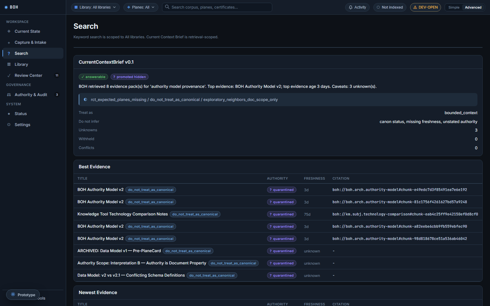
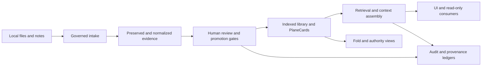

# Bag of Holding

Bag of Holding (BOH) is a local-first knowledge workbench for teams that need
more than file search. It preserves source evidence, separates authority from
relevance, routes risky material through review, and produces cited context for
people and read-only AI consumers.

The operating doctrine is simple:

> LLM proposes. Human governs. System audits.

BOH is designed for work where “the system found a passage” is not enough. A
useful answer also needs provenance, authority posture, conflict state,
freshness, and an explicit account of what was withheld.

## What the product demonstrates

- **Governed capture and intake** — accept supported text and document formats,
  preserve source bytes, normalize inert content, quarantine unsafe formats,
  and keep promotion separate from ingestion.
- **Authority-aware retrieval** — return bounded evidence packs with citations,
  source spans, warnings, lineage, review state, and strict-answer withholding.
- **Current Context Briefs** — assemble the newest and strongest permitted
  evidence while naming conflicts, unknowns, and unsupported conclusions.
- **Human review surfaces** — inspect conflicts, proposed changes, approvals,
  provenance, and audit events from one local interface.
- **Fold Workspace** — explore the library through currentness, risk,
  authority, evidence-state, and time projections without changing the corpus.
- **Least-privilege MCP controls** — model a fixed read-only remote profile and
  keep local operator and retrieval credentials out of child environments.
- **Deterministic verification** — exercise the application with isolated demo
  data, a full pytest suite, security-focused tests, and a fail-closed public
  export audit.

## Product tour

All images below are captures of the real BOH application running against an
isolated seeded demo. They contain no private corpus or operator data.

### Governed workspace

| Current state | Capture and intake | Library |
| --- | --- | --- |
|  |  |  |

### Retrieval and review

| Current Context search | Review center | Authority and audit |
| --- | --- | --- |
|  |  |  |

### Operations and exploration

| Runtime status | Fold Workspace | Context Pack Builder |
| --- | --- | --- |
|  |  |  |

## How it fits together



The repository is a Python/FastAPI application with SQLite persistence and a
build-free ES-module frontend. Core logic lives under `app/core`, API routes
under `app/api`, governed intake services under `app/services/intake`, and the
browser UI under `app/ui2`.

The design intentionally separates four concerns:

1. **Storage** preserves source and normalized artifacts.
2. **Governance** records authority, review, lineage, conflicts, and promotion.
3. **Retrieval** selects and assembles permitted evidence without granting
   mutation authority.
4. **Presentation** makes the state inspectable in the UI and, in the complete
   operator deployment, through a narrow read-only MCP profile.

See [Architecture](docs/architecture/README.md),
[Whitepaper](docs/whitepaper.md), and the
[Glossary](docs/GLOSSARY.md) for deeper context.

## Security model

BOH is local-first, not a hosted service. This repository ships source and demo
tools; it does not ship a database, corpus, tunnel, runtime key, OAuth tenant,
or operator configuration.

- `BOH_LIBRARY` defines the server-owned library boundary.
- `BOH_DB` selects the SQLite database.
- Mutation routes use a distinct operator boundary.
- Retrieval routes use a separate read-only credential boundary.
- Environment-managed credentials take precedence over UI-managed verifiers.
- UI-managed plaintext credentials remain in the current browser tab; the
  database stores salted verifiers, not plaintext.
- Intake never implies canonical promotion. Promotion is explicit, audited,
  reversible, and hidden by default from retrieval.
- The app-side connector contract excludes BOH operator, retrieval, and
  control-plane credentials from remote MCP child environments.

Read [Security](SECURITY.md), [Security policy](SECURITY_POLICY.md), and
[Retention policy](RETENTION_POLICY.md) before using BOH with real material.

## MCP publication boundary

The complete operator deployment supports two OpenAI tunnel startup shapes:

- **OAuth gateway mode** — a localhost OAuth/JWKS gateway protects the remote
  resource with the fixed `boh.read` scope.
- **Stdio no-auth mode** — the tunnel launches the fixed ChatGPT-safe BOH stdio
  adapter directly for a ChatGPT app configured with **No Authentication**.

Both shapes were verified at the complete-source boundary to expose:

- 8 read-only tools
- 0 resources
- 0 prompts
- no operator, shell, upload, reset, promotion, or review authority

The complete-source full-local adapter remains a separate `13 tools / 4
resources / 4 prompts` profile. Direct-safe results and adapter-origin errors
share the same recursive path/credential redaction contract as the OAuth
gateway.

This sanitized repository intentionally excludes the operational adapter,
gateway, tunnel startup helper, runtime profiles, and connector smoke tool.
Those components read operator-local control material and do not belong in the
public source boundary. The public tree retains the app-side configuration,
lifecycle, credential-scrubbing, and fail-soft startup contract plus tests for
that contract. It is not, by itself, a runnable MCP deployment.

## Quick start

Requirements: Python 3.11 and a local checkout.

```powershell
python -m venv .venv
.\.venv\Scripts\Activate.ps1
python -m pip install -r requirements.txt
python launcher.py --no-mcp
```

Open `http://127.0.0.1:8000/`.

The default local posture is intended for development. Configure operator and
retrieval credentials before using protected or retrieval surfaces outside a
single-user loopback setup. See [Run instructions](RUN_INSTRUCTIONS.md) and the
[Variable matrix](docs/VARIABLE_MATRIX.md).

## Isolated demo

To explore without a real corpus, bind BOH to disposable locations, seed the
demo library, then launch the app:

```powershell
$demo = Join-Path $env:TEMP "boh-demo"
$env:BOH_DB = Join-Path $demo "boh-demo.db"
$env:BOH_LIBRARY = Join-Path $demo "library"
$env:BOH_DATA_ROOT = Join-Path $demo "data"
python seed_full_demo.py
python launcher.py --no-mcp
```

The seed contains synthetic governance, retrieval, conflict, freshness, and
Fold examples. It is deterministic and does not read a private library. For a
surface-by-surface walkthrough, see the [Demo runbook](docs/DEMO_RUNBOOK.md).

## Verification

Run the full suite:

```powershell
python -m pytest tests -q
```

Focused MCP/security verification:

```powershell
python -m pytest tests\test_mcp_connector_startup.py tests\test_security_token_settings.py -q
```

The GitHub Actions workflow runs the full Python 3.11 suite for pushes and pull
requests. Public releases are additionally built from an explicit allowlist,
audited independently for private paths, credentials, project-specific names,
forbidden files, and image metadata, and recorded in
`PUBLIC_EXPORT_MANIFEST.txt`.

## Repository boundaries

The public repository is a sanitized source export. It intentionally excludes:

- runtime SQLite databases and backups;
- corpus, library, quarantine, and generated report data;
- credentials, environment files, tunnel profiles, and run logs;
- local governance/control records and operator handoffs;
- operational MCP adapter, gateway, tunnel startup, and smoke tooling;
- private test fixtures and machine-specific configuration.

The absence of those files is a security boundary, not a missing setup step.
Use `.env.example` only as a variable-name reference and supply your own local
values.

## Further reading

- [Roadmap](ROADMAP.md)
- [Database migrations](docs/db_migrations.md)
- [Math authority](docs/math_authority.md)
- [Current Fold View](docs/current_fold_view_phased_variable_map.md)
- [Folded-node visualization](docs/visualization_folded_node_view.md)
- [Project variable map](docs/project_variable_map.md)

## License

Released under the [MIT License](LICENSE).
