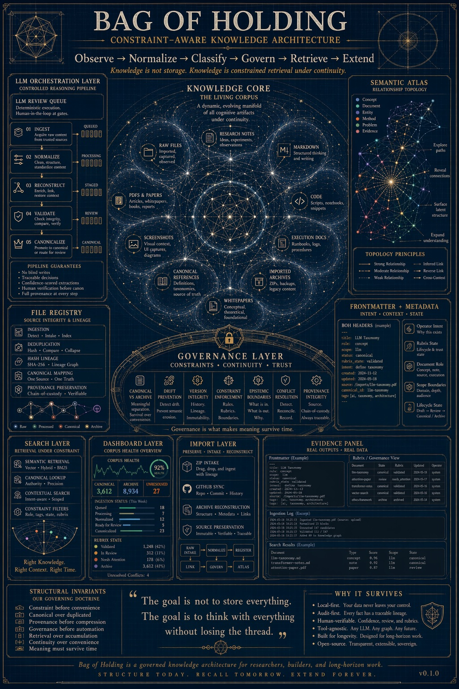
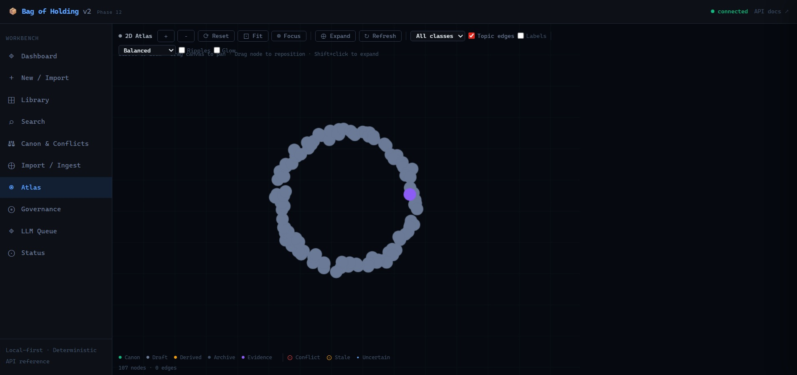
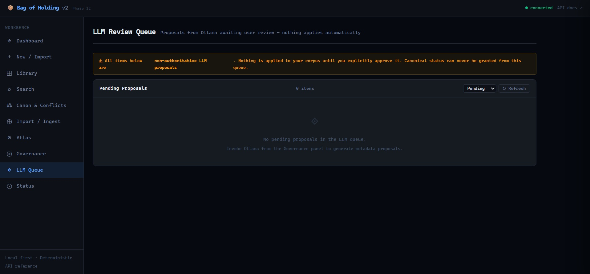
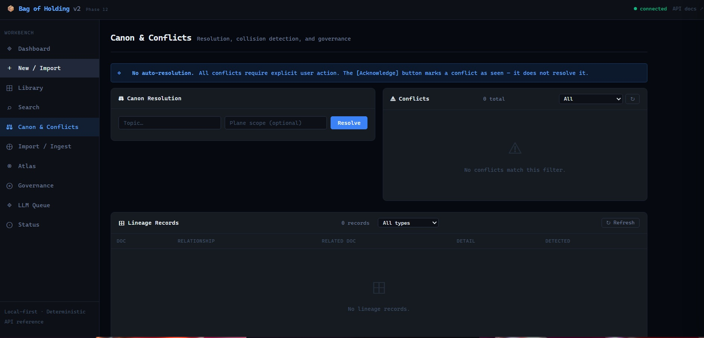
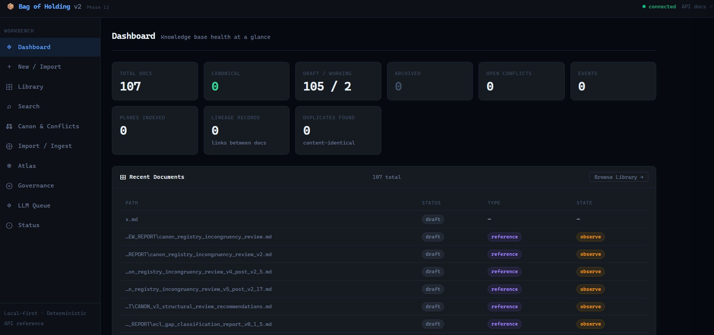
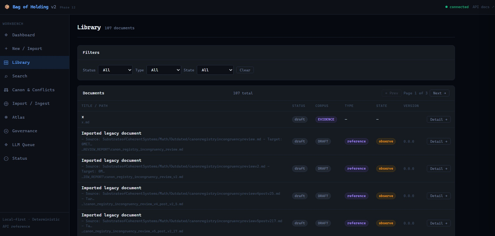
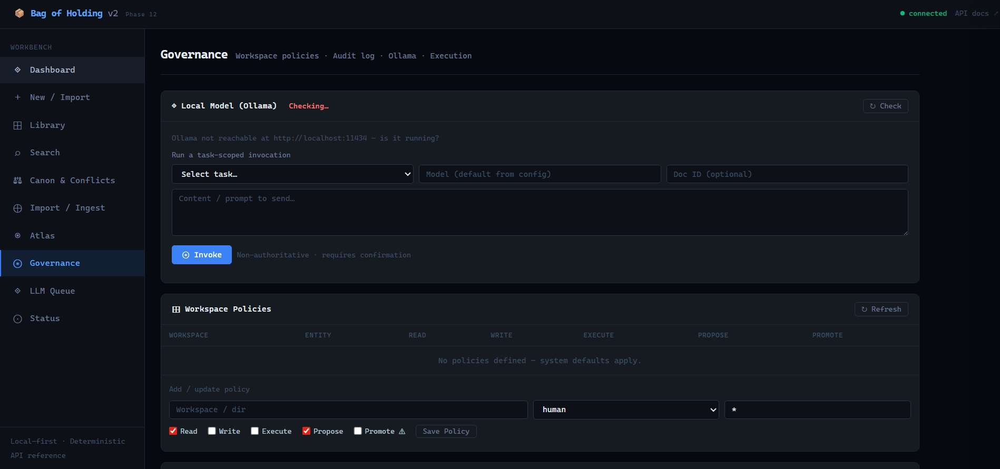
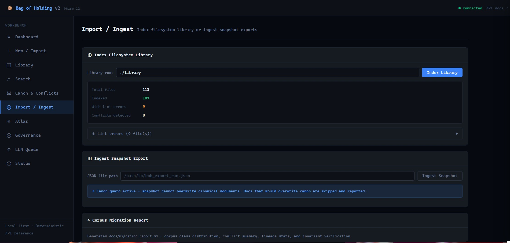
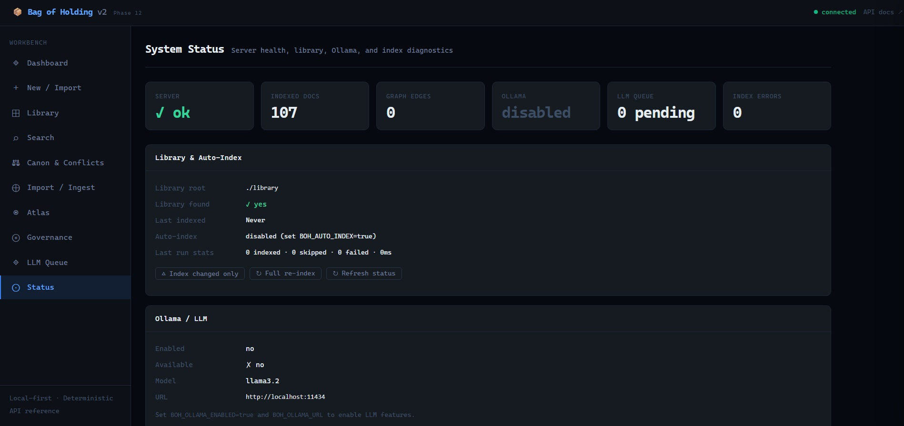

# 📦 Bag of Holding

**A constraint-governed local knowledge workbench for persistent human–LLM reasoning.**

Local-first · SQLite + Markdown · No cloud dependency · Governed LLM integration

---

Bag of Holding is not a notes app.

It is an operational substrate for maintaining knowledge integrity across time, users, and changing model layers. Documents are not merely stored — they are governed: classified, versioned, linked, audited, and verified before anything becomes canonical.

Most tools help you store information.  
BOH is built to help you decide what should be *trusted*, what *conflicts*, what is *stale*, what becomes *canonical*, and *why*.

---

## Why It Matters

Organizations do not lose knowledge because people fail to document.  
They lose knowledge because systems fail to preserve authority.

A decision made in March becomes institutional fog by September — the rationale gone, the reasoning lost, the constraint invisible to the people now affected by it. Retrieval does not solve this. Governance does.

BOH treats knowledge as a governed lifecycle rather than a searchable collection. Every document carries lineage. Every lifecycle change is recorded. Nothing becomes canonical by accident. The LLM assists — it does not decide.

---

## Screenshots



*Architecture overview: the full system from ingestion through canonicalization, governance layer, and Atlas relationship topology.*

---



*Atlas renders the relationship field: what depends on what, what conflicts, what is stale, where authority flows.*

---



*The LLM proposes. The human governs. Nothing applies to the corpus until explicitly approved. Canonical status can never be granted from this queue.*

---



*All conflicts require explicit user action. The Acknowledge button marks a conflict as seen — it does not resolve it.*

---

## Quickstart

BOH runs locally with no cloud dependency and no external services required.

```bash
git clone https://github.com/ppeck1/Bag-of-Holding.git
cd Bag-of-Holding
pip install -r requirements.txt
python launcher.py
```

Opens at `http://127.0.0.1:8000` automatically.

**Windows:** double-click `launcher.bat`  
**macOS / Linux:** `chmod +x launcher.sh && ./launcher.sh`

**Environment variables (all optional):**

```bash
BOH_LIBRARY=./library           # path to your document library
BOH_AUTO_INDEX=true             # scan and index on startup (default: false)
BOH_OLLAMA_ENABLED=true         # enable LLM review queue
BOH_OLLAMA_URL=http://localhost:11434
BOH_OLLAMA_MODEL=mistral-small
```

Auto-index and Ollama are **off by default**. Enable them explicitly when ready.

---

## First Use

```
1. Drop your folder into the library path
2. Open dashboard → click "Re-index library"
3. Visit Library → review what was indexed
4. Open LLM Queue → review any Ollama proposals
5. Approve or reject each proposal individually
6. Resolve conflicts in Canon & Conflicts
7. Advance documents through the Rubrix lifecycle
8. Open Atlas to explore relationships visually
9. Canonize intentionally — never automatically
```

---

## Core Invariants

These rules are enforced at the data layer, not by convention.

- **Local-first** — SQLite + filesystem. No cloud dependency, no external services.
- **No silent canon overwrite** — canonical documents cannot be replaced without explicit user action.
- **No auto-resolution** — conflicts surface and stay until explicitly addressed.
- **LLM non-authoritative** — all model outputs require user approval before any change applies.
- **Append-only lifecycle history** — undo and backward moves create new records; nothing is deleted.
- **Duplicates linked, never deleted** — lineage preserved; both versions kept.
- **Server startup never blocked** — auto-index and Ollama failures are caught and logged; the server always boots.

---

## Architecture

BOH is built as a local knowledge operating system, not a single application.

**Ingestion** → controlled intake of Markdown, PDFs, and legacy documents  
**Normalization** → frontmatter standardization, duplicate identification, schema alignment  
**Lifecycle engine** → `observe → vessel → constraint → integrate → release` with reversible transitions  
**Canon & conflicts** → deterministic scoring resolves authority; conflicts surface and stay until explicitly resolved  
**Graph layer** → explicit edges for lineage, derivation, conflict, and supersession  
**Atlas** → force-directed visualization of the full relationship field  
**LLM interface** → task-scoped Ollama integration with inlet/outlet filters and mandatory review queue  
**Audit log** → every mutation appended; never deleted

Document format is plain Markdown with `boh:` YAML frontmatter. Knowledge survives software changes.

```yaml
boh:
  id: unique-id-001
  type: canonical
  status: canonical
  topics: [triage escalation, clinical workflow]
  rubrix:
    operator_state: release
    operator_intent: canonize
```

---

## Further Reading

- **Whitepaper:** [`docs/whitepaper.md`](docs/whitepaper.md) — architecture rationale, design philosophy, and positioning
- **API reference:** `http://127.0.0.1:8000/docs` (interactive, auto-generated when running)
- **Scoring formulas:** [`docs/math_authority.md`](docs/math_authority.md)

---

## More Screenshots

<details>
<summary>Dashboard, Library, Governance, Import, Status</summary>











</details>

---

*Systems fail where memory becomes folklore.*

*Local-first · SQLite + Markdown · No cloud dependency*  
*github.com/ppeck1/Bag-of-Holding*

