# Bag of Holding

> **A trusted workspace for preserving your thinking.**

Bag of Holding is a local-first knowledge workbench for people who care not just about storing information, but about knowing where it came from, what it connects to, and whether it can be trusted.

It is built around a simple but demanding premise: *reasoning should be durable*. Documents carry provenance. Authority transfers require explicit approval. LLM outputs are proposals, not facts. Canonical truth is earned, not inferred.

---

## What Problem Does This Solve?

Most knowledge tools help you find information.  
Bag of Holding helps you *defend* it.

It is designed for situations where silent drift is dangerous:

- LLM-assisted writing and document synthesis
- Research, policy, and compliance work
- Technical documentation and systems design
- Long-running projects with many contributors or versions
- Any corpus where "what is currently true" matters operationally

---

## Screenshots

### Dashboard

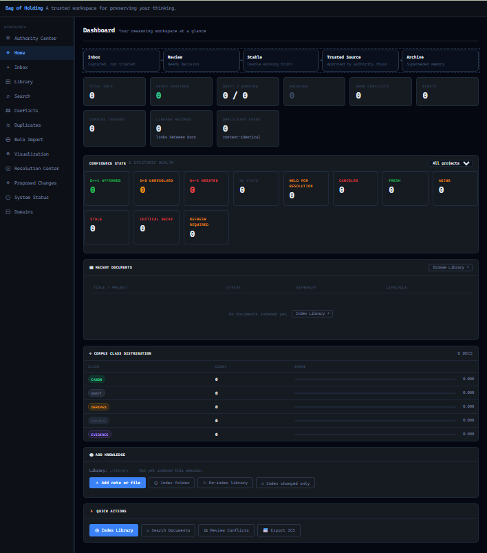

The Dashboard provides an at-a-glance view of your reasoning workspace. Document state swimlanes (Inbox → Review → Stable → Trusted Source → Archive) show where knowledge stands in the governance pipeline. The **Confidence State / Epistemic Health** panel tracks d-state distribution across your corpus: affirmed, unresolved, negated, held for resolution, fresh, aging, stale, and critically decayed. The Corpus Class Distribution shows the ratio of Canon, Draft, Derived, Archive, and Evidence documents. Quick Actions — Index Library, Search Documents, Review Conflicts, Export ICS — are available from the bottom of the panel.

---

### Inbox

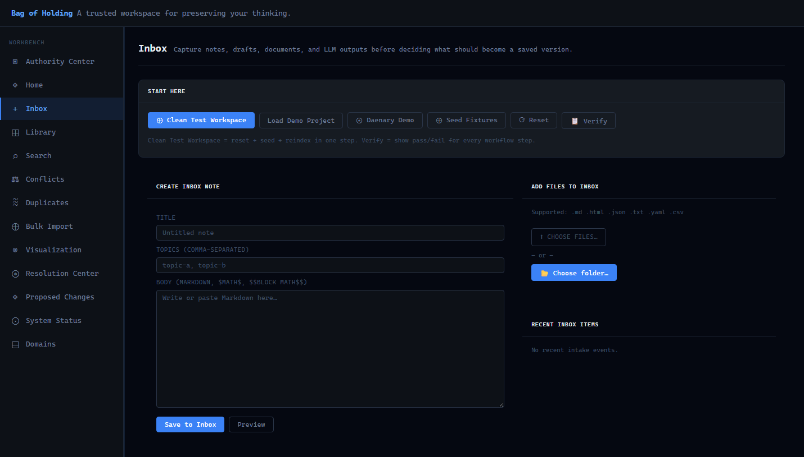

The Inbox is where unvetted knowledge enters the system. Notes can be created directly using Markdown with `$MATH$` and `$$BLOCK MATH$$` support, or files can be uploaded individually or by folder. Supported formats: `.md`, `.html`, `.json`, `.txt`, `.yaml`, `.csv`. Nothing ingested through the Inbox becomes canonical automatically. The **START HERE** toolbar provides: Clean Test Workspace, Load Demo Project, Daenary Demo, Seed Fixtures, Reset, and Verify — a full workflow verification run that reports pass/fail for every pipeline stage.

---

### Library

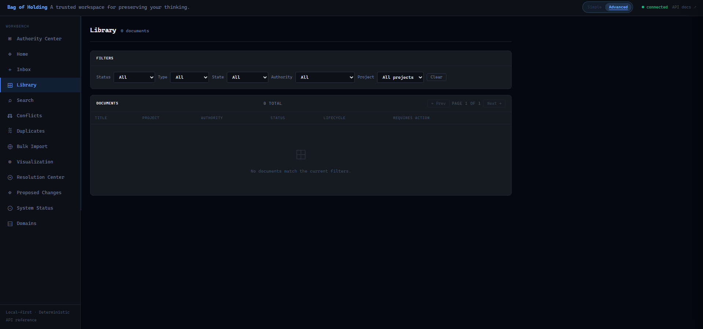

The Library is the indexed document registry. Filter by Status, Type, State, Authority, and Project. Documents are displayed with their Title, Project, Authority level, Status, Lifecycle state, and any pending Required Actions. The library is the governed view of what has been indexed — not just what has been stored.

---

### Search

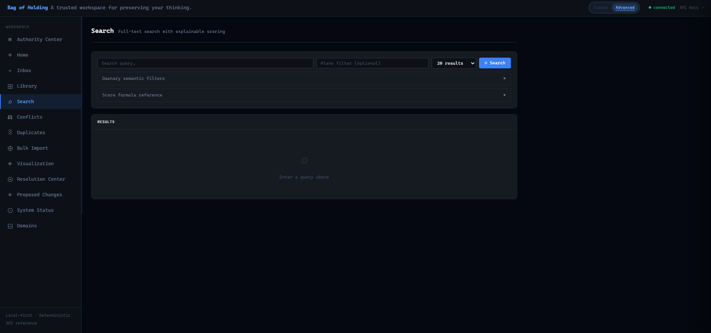

Full-text search with **explainable composite scoring**. Results include breakdown of why each document ranked where it did. **Daenary semantic filters** allow filtering by epistemic state dimensions (d-state, quality, confidence, mode, temporal validity). The **Score Formula Reference** panel documents the exact scoring logic. Plane-scoped search is available for filtering across named knowledge planes.

---

### Conflicts

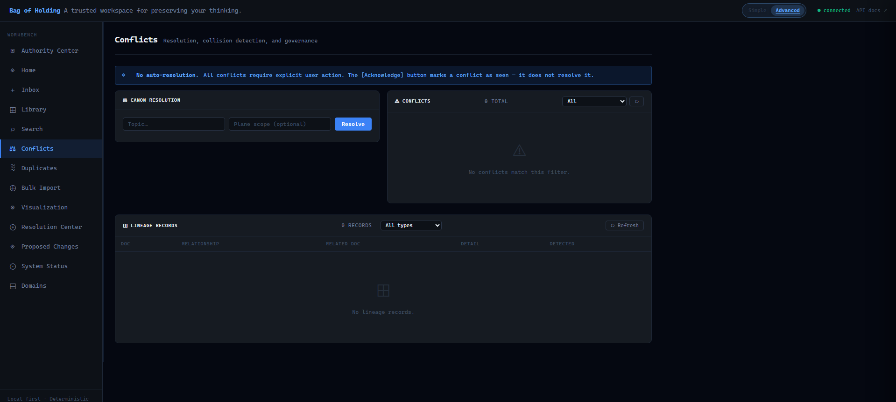

The Conflicts panel handles canon collision detection and lineage governance. A persistent warning enforces the core invariant: **no auto-resolution**. All conflicts require explicit user action. The Acknowledge button marks a conflict as seen — it does not resolve it. The **Canon Resolution** panel accepts a topic and optional plane scope and runs deterministic resolution on demand. The **Lineage Records** table shows all derivation, supersession, and relationship links across the corpus.

---

### Duplicate Review

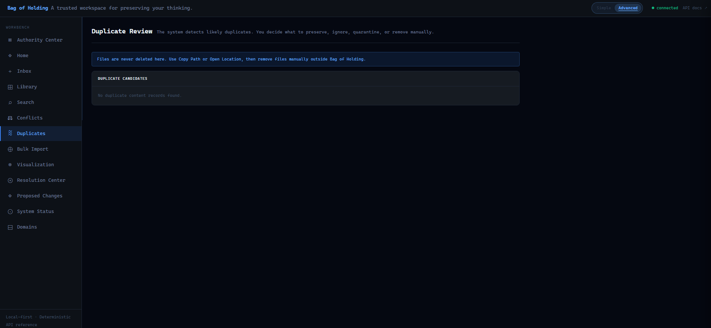

The Duplicate Review panel surfaces content-identical documents detected during indexing. Files are **never deleted** by Bag of Holding. The workflow is: review the candidate pair, use Copy Path or Open Location to verify, then remove the unwanted file manually outside of BOH. Lineage links are created and preserved regardless of which copy is kept.

---

### Bulk Import

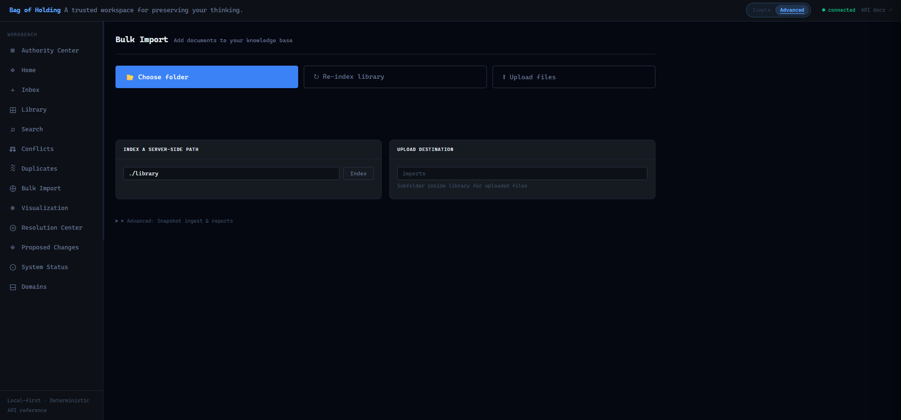

Three import pathways: **Choose folder** (OS folder picker), **Re-index library** (re-scans the configured library path), and **Upload files** (direct file drop). The **Index a Server-Side Path** panel accepts any filesystem path for server-side indexing. The **Upload Destination** panel sets the subfolder within the library for uploaded files. **Advanced: Snapshot ingest & reports** is available for structured corpus transfers with canon guard enforcement.

---

### Visualization — Web (Relational)

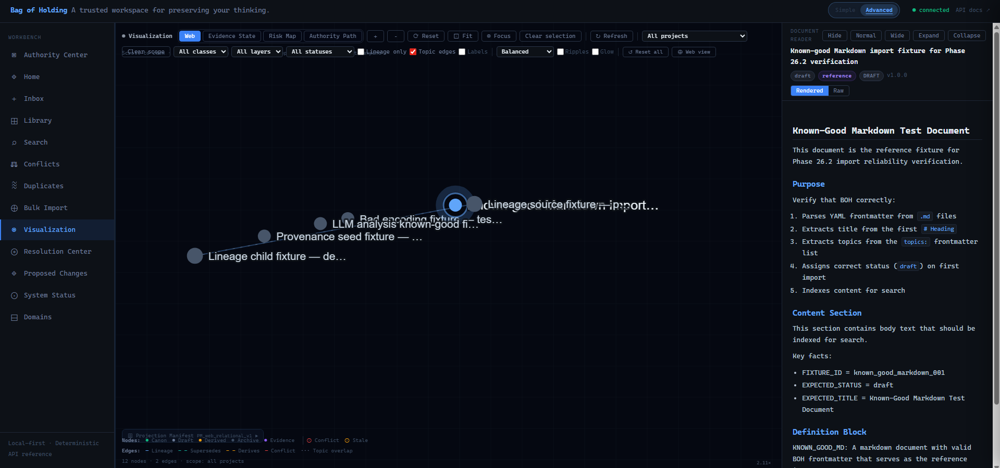

The Visualization panel renders your corpus as a force-directed relationship graph. **Web mode** shows the full relational topology. Nodes are colored by corpus class (Canon, Draft, Derived, Archive, Evidence, Conflict, Stale). Edges are typed: Lineage (solid blue), Supersedes (teal dashed), Derives (amber dashed), Conflict (red solid), Topic overlap (grey dotted). A **Document Reader pane** opens on the right when a node is selected, showing the full rendered document content without leaving the visualization. Filter controls: class, layer, status, lineage-only mode, topic edge toggle, label display, physics preset (Balanced / High Quality / Static), Ripples, and Glow.

---

### Visualization — Evidence State

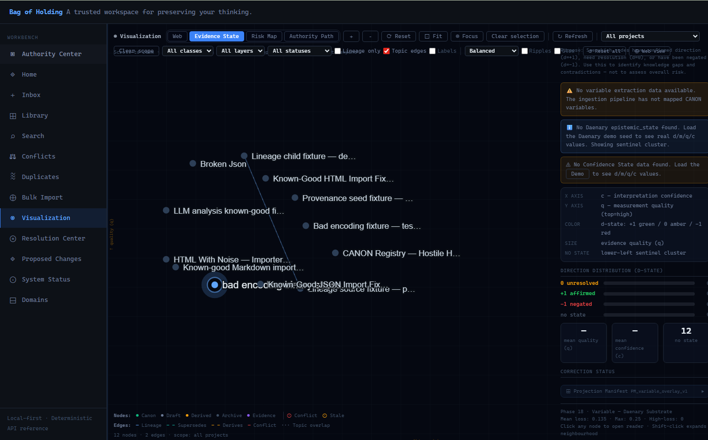

**Evidence State mode** plots each document on a 2D plane where X = interpretation confidence (c) and Y = measurement quality (q). Node color encodes d-state (+1 green / 0 amber / −1 red). Node size reflects evidence quality. Documents with no epistemic state cluster in the lower-left sentinel zone. The right panel shows Direction Distribution (d-state histogram), mean quality and confidence values, and Correction Status with the active Projection Manifest. This mode is used to identify knowledge gaps, contradictions, and documents requiring epistemic intervention.

---

### Visualization — Risk Map

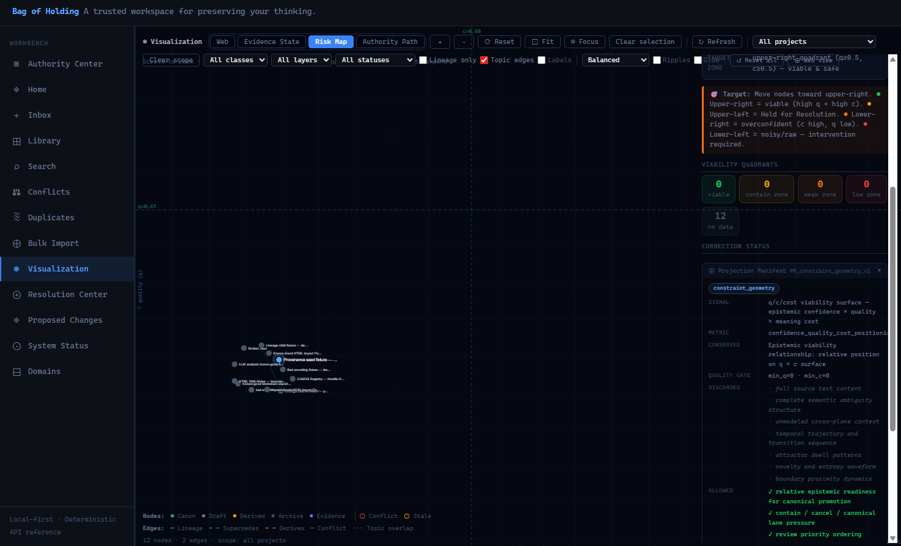

**Risk Map mode** applies a constraint geometry projection to the corpus. Documents are positioned by their q/c viability surface — epistemic confidence × quality × meaning cost. The four viability quadrants define actionable zones: **Viable** (high q, high c), **Contain Zone**, **Weak Zone**, and **Low Zone** (intervention required). The goal state is upper-right. The Projection Manifest panel shows the active signal, conserved metric, quality gate thresholds, discarded dimensions, and allowed governance actions.

---

### Visualization — Authority Path

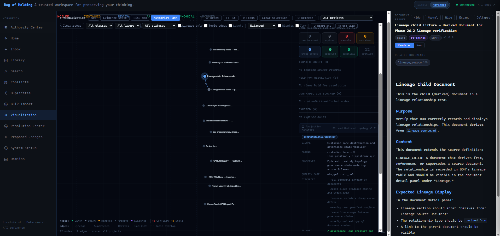

**Authority Path mode** applies the constitutional topology projection, visualizing each document's position in the custodian lane × governance state ordering. Lane distribution counters show how many documents are in each governance state: raw imported, expired, cancelled, contained, under review, approved, canonical, archived. Contradiction-blocked and held-for-resolution nodes are surfaced explicitly. This mode is used to identify governance bottlenecks and unresolved authority transitions.

---

### Resolution Center

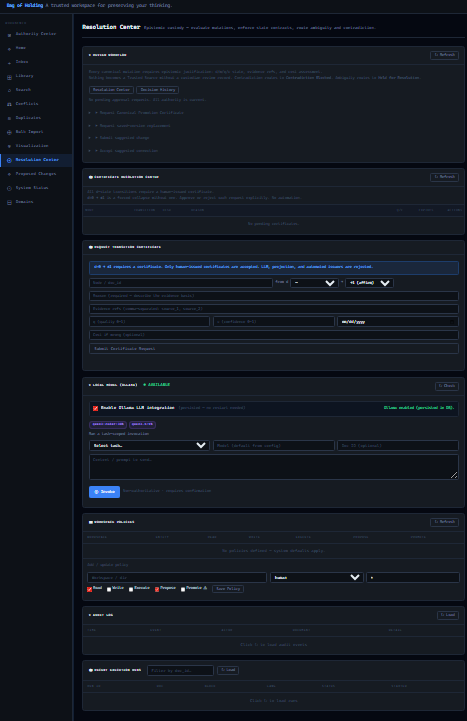

The Resolution Center is the primary governance control surface. It consolidates multiple resolution workflows:

- **Canon Resolution** — evaluate topic authority across planes, with Decision History
- **Certification Validation Center** — all authority transitions require a certificate; only hash-based, id-projection, and automated issuers are accepted
- **Request-Transition Certificates** — submit certification requests with justification and conflict hash
- **LLM Model (Ollama)** — invoke Ollama for metadata generation, with model/URL/project scope controls; Enable toggle is persisted without restart
- **Governance Policies** — workspace-level default policies with per-document overrides; policy status and action pipeline visible inline
- **Audit Log** — append-only record of every authority event
- **Packet Substrate Mode** — load public source feeds for cross-corpus verification

---

### Proposed Changes

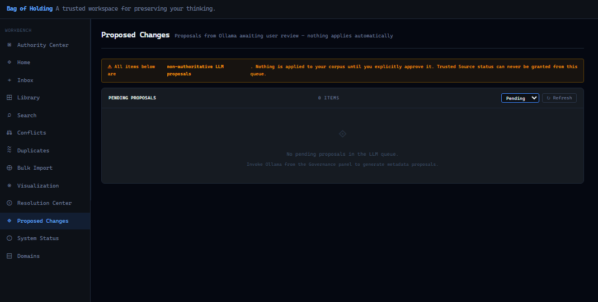

All Ollama-generated metadata proposals land here before touching the corpus. The persistent banner is explicit: **all items are non-authoritative LLM proposals. Nothing applies until you explicitly approve it. Trusted Source status can never be granted from this queue.** Proposals can be filtered by state (Pending, Approved, Rejected). Each proposal shows the target document, proposed changes, and requires individual review and approval action before anything is applied.

---

### System Status

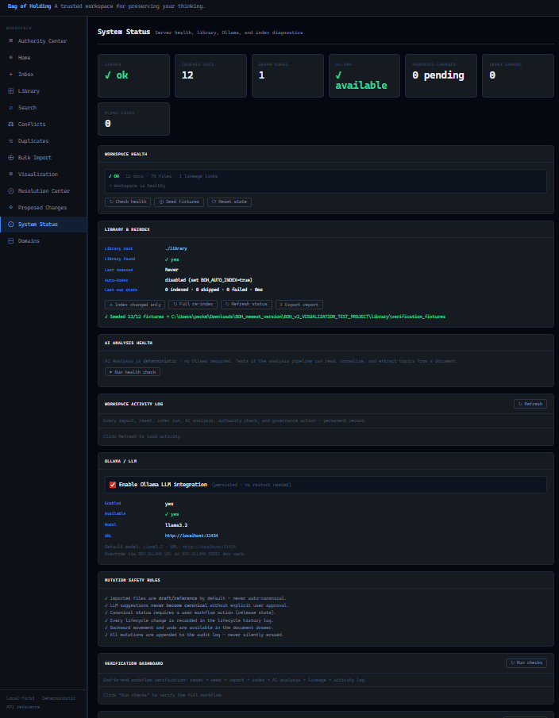

The System Status panel provides full operational diagnostics:

- **Server health**: OK / error state
- **Indexed docs**, **graph edges**, **Ollama availability**, **pending proposed changes**, **index errors**, **plane cards**
- **Workspace Health**: document count, file count, lineage links, health assertion
- **Library & Reindex**: library root, auto-index state, last indexed timestamp, last run stats
- **AI Analysis Health**: deterministic analysis pipeline status (no Ollama required for baseline analysis)
- **Workspace Activity Log**: every import, reset, index run, AI analysis, authority check, and governance action
- **Ollama / LLM**: enable/disable toggle (persisted, no restart needed), model, URL configuration
- **Mutation Safety Rules**: the five invariants enforced at the data layer
- **Verification Dashboard**: run end-to-end workflow verification (reset → seed → import → index → AI analysis → lineage → activity log)

---

### Domains (PlaneCards)

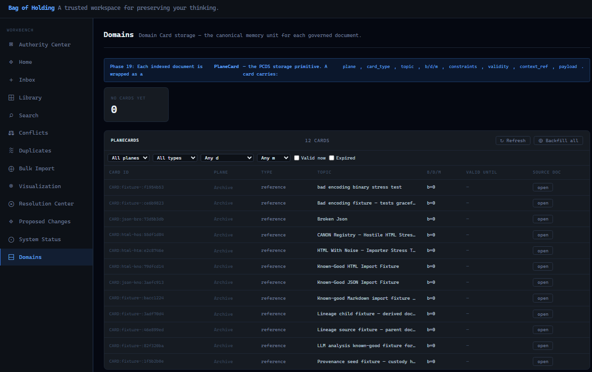

The Domains panel is the Phase 19 PCDS (PlaneCard Data Structure) surface. Every indexed document is wrapped as a **PlaneCard** — the PCDS storage primitive. Each card carries: `plane`, `card_type`, `topic`, `b/d/m` (belief/direction/mode), `constraints`, `validity`, `context_ref`, and `payload`. The panel shows both the PlaneCard count and the full PlaneCard table with filtering by plane, type, validity window, and mode. Source document links are preserved for every card. **Backfill all** regenerates PlaneCards for the full corpus from existing index data.

---

### CA Explorer (Companion Tool)

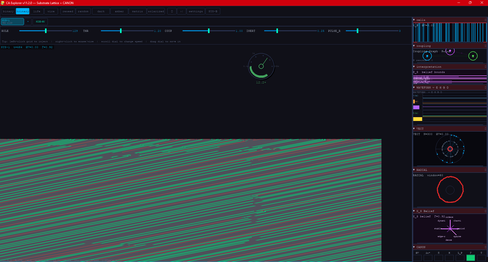

**CA Explorer v11.2.0** is a companion research application (Substrate Lattice + CANON). It provides cellular automata-based substrate analysis integrated with BOH's CANON layer. Parameters — RULE, THR (threshold), COUP (coupling), INERT (inertia), PULSE_R — govern the substrate dynamics. The side panel provides real-time diagnostics: cell state, coupling graph, X_S belief bounds, waveform analysis (E H B D channels), VECT (vector field, N=300), RADIAL analysis, X_S Belief state (dynamic/stable/edge-z/period/chaotic/sparse/dense), and the CANON state table. SYS-1 displays current tick, ΔV, and T values. This tool runs alongside BOH and feeds substrate-level confidence and belief readings back into the epistemic state layer.

---

## What BOH Is Not

| Tool | Strength | What it lacks |
|------|----------|---------------|
| **Obsidian** | Personal cognition and note-linking | Governance, auditability, canonical enforcement, constrained LLM |
| **Notion** | Collaboration and presentation | Strict lifecycle control, provenance enforcement, review-safe mutation |
| **Jupyter** | Execution and experimentation | Long-term canonization, cross-document governance, decision lineage |
| **Git** | Code version control | Semantic conflict detection, document lifecycle, knowledge governance |
| **BOH** | **Operational cognition + institutional memory** | — |

---

## System Philosophy

**LLM proposes. Human governs. System audits.**

BOH treats language models as assistants, not authorities.

The model **may**:
- summarize and classify documents
- suggest relationships and topics
- detect possible conflicts
- propose metadata and lifecycle state
- generate review artifacts

The model **may not**:
- silently overwrite canonical files
- auto-promote documents to canon or Trusted Source
- bypass operator review
- apply any change without explicit user approval

This is not a safety limitation. It is the architectural principle.

Epistemic integrity requires that *humans own the canon*. BOH enforces this at the data layer.

---

## Core Invariants (never violated)

- **Local-first** — SQLite + filesystem. No cloud dependency.
- **Deterministic scoring** — same inputs always produce same outputs. All formulas in `docs/math_authority.md`.
- **No silent canon overwrite** — canonical documents cannot be replaced without explicit workflow action.
- **No auto-resolution** — conflicts surface and remain until explicitly addressed.
- **LLM artifacts non-authoritative** — proposals go to review queue only; `non_authoritative: true` hardcoded.
- **Append-only lifecycle history** — undo and backward moves create new history records, never delete old ones.
- **Duplicates linked, never deleted** — lineage links created; both versions preserved.
- **Rubrix ≠ Daenary** — lifecycle governance and epistemic state are separate, non-overlapping systems.
- **Server startup never blocked** — auto-index and Ollama failures are caught, logged, and reported; server always boots.
- **Authority transitions require certificates** — no governance state change without a hash-signed certification record.

---

## Quickstart

```bash
cd boh_v2
pip install -r requirements.txt
python launcher.py
```

Opens at `http://127.0.0.1:8000` automatically.

**Windows:** double-click `launcher.bat`  
**macOS / Linux:** `chmod +x launcher.sh && ./launcher.sh`

**Optional environment variables:**

```bash
BOH_LIBRARY=./library          # path to your document library
BOH_AUTO_INDEX=true            # scan and index on startup (default: false)
BOH_AUTO_INDEX_MAX_FILES=5000  # startup scan cap
BOH_OLLAMA_ENABLED=true        # enable LLM review queue
BOH_OLLAMA_URL=http://localhost:11434
BOH_OLLAMA_MODEL=llama3.2
```

Auto-index is **off by default**. Enable it explicitly when your library is ready.

---

## First-Use Workflow

```
1.  Drop your folder into the library path (BOH_LIBRARY=./your-folder)
2.  Open the Inbox — click "Clean Test Workspace" to start from a known state
3.  Click "Index Library" or set BOH_AUTO_INDEX=true and restart
4.  Visit the Library panel — review what was indexed and its initial lifecycle state
5.  Open Proposed Changes — review any Ollama-generated metadata proposals
6.  Approve or reject each proposal individually (none apply automatically)
7.  Resolve any conflicts in the Conflicts panel (no auto-resolution)
8.  Use the Resolution Center to run Canon Resolution on contested topics
9.  Advance documents through the Rubrix lifecycle toward Stable and Trusted Source
10. Use backward movement or undo if a state transition was premature
11. Open Visualization → Web to explore document relationships
12. Switch to Evidence State, Risk Map, or Authority Path for epistemic analysis
13. Review the Domains panel to inspect PlaneCard coverage
14. Canonize intentionally — never automatically
```

Nothing in steps 5–14 happens without your explicit action. That is the design.

---

## What BOH Does

| Area | Capability |
|------|-----------|
| **Library** | Index and browse Markdown documents with `boh:` YAML frontmatter |
| **Rubrix Lifecycle** | Governed state transitions: observe → vessel → constraint → integrate → release, with reversible backward movement and append-only history |
| **Canon Resolution** | Deterministic scoring to identify the authoritative document on any topic or plane |
| **Conflict Detection** | Definition conflicts, canon collisions, planar conflicts — surfaces them, never auto-resolves |
| **LLM Review Queue** | Ollama-powered metadata proposals held for review; nothing applies without user approval |
| **Visualization — Web** | Force-directed relational graph with zoom, pan, node drag, edge hover, typed edges, and inline document reader |
| **Visualization — Evidence State** | 2D epistemic scatter plot (confidence × quality) with d-state coloring and Projection Manifest |
| **Visualization — Risk Map** | Constraint geometry viability surface with quadrant analysis and governance action recommendations |
| **Visualization — Authority Path** | Constitutional topology projection showing custodian lane distribution and governance bottlenecks |
| **Resolution Center** | Consolidated governance surface: canon resolution, certification, LLM invocation, policies, audit log |
| **Proposed Changes** | Non-authoritative LLM proposal queue; Trusted Source status cannot be granted from here |
| **Domains / PlaneCards** | Phase 19 PCDS layer: every indexed document wrapped as a PlaneCard with full epistemic metadata |
| **Search** | Full-text search with explainable composite scoring and Daenary semantic filters |
| **Planar Math** | Directional fact storage and scoring across named planes, fields, and nodes |
| **Daenary** | Epistemic state encoding: d-state (−1/0/+1), quality, confidence, mode, temporal validity |
| **Lineage** | Derivation tracking, supersession chains, content duplicate detection |
| **DCNS** | Explicit relationship edge graph with per-node load diagnostics and edge permeability |
| **Audit Log** | Every significant mutation appended; never deleted; available via `/api/audit` |
| **System Status** | Full operational diagnostics: library health, Ollama state, mutation safety rules, verification dashboard |
| **Duplicate Review** | Hash-based duplicate detection with lineage linking; files never deleted by the system |
| **Bulk Import** | Folder picker, server-path indexing, file upload, snapshot ingest with canon guard |
| **Events** | Extract and export calendar events from documents as ICS data |
| **CA Explorer** | Companion substrate lattice application with CANON integration for belief-state analysis |

---

## Rubrix Lifecycle

Documents move through governed operational states:

```
observe → vessel → constraint → integrate → release
```

Each transition is recorded in `lifecycle_history`. Backward movement and undo are available at every stage — they create new history entries, never delete old ones.

| State | Meaning |
|-------|---------|
| `inbox` | Captured, not yet trusted |
| `review` | Needs decision |
| `stable` | Drafts seeking truth |
| `trusted_source` | Approved by authority chain |
| `archive` | Superseded memory |

---

## Visualization Modes

| Mode | Projection | Use Case |
|------|-----------|---------|
| **Web** | Relational topology | Overview, lineage tracing, relationship exploration |
| **Evidence State** | Confidence × Quality scatter | Epistemic gap detection, d-state health |
| **Risk Map** | Constraint geometry viability | Governance prioritization, intervention targeting |
| **Authority Path** | Constitutional lane topology | Promotion bottleneck analysis, authority audit |

Each mode uses a **Projection Manifest** that defines the active signal, conserved metric, quality gate, and allowed governance actions for that view.

---

## Atlas — Interaction Model

| Action | Effect |
|--------|--------|
| Scroll wheel | Zoom in/out centered on cursor |
| Drag empty canvas | Pan the view |
| Drag a node | Reposition node, re-energize physics |
| Click node | Open document in reader pane |
| Double-click node | Expand neighborhood one hop |
| Shift+click node | Expand neighborhood |
| Hover node | Title, status, conflict/stale indicators |
| Hover edge | Shared topics, edge type, confidence |

**Physics presets:** Balanced (batched edges, 30fps cap) · High Quality · Static (render on demand, no continuous animation)  
**Effects:** Ripples · Glow (auto-reduce if any frame exceeds 28ms)

---

## Edge Types

| Edge | Visual | Meaning |
|------|--------|---------|
| Lineage | Solid blue, 1.6px | Explicit derivation / version chain |
| Supersedes | Teal dashed | One document replaced another |
| Derives | Amber dashed | Derived from another source |
| Conflict | Red solid | Detected definition or canon conflict |
| Topic overlap | Grey dotted, very faint | Semantic similarity (suggested only) |

---

## Resolution Center — Sections

| Section | Purpose |
|---------|---------|
| **Canon Resolution** | Run topic-scoped deterministic resolution with decision history |
| **Certification Validation Center** | Validate and inspect authority transition certificates |
| **Request-Transition Certificates** | Submit certification requests for governance state changes |
| **LLM Model (Ollama)** | Invoke Ollama for metadata generation; toggle persisted without restart |
| **Governance Policies** | Workspace-level default policies and per-document overrides |
| **Audit Log** | Append-only governance event record |
| **Packet Substrate Mode** | Load public source feeds for cross-corpus verification |

---

## PlaneCards (Phase 19)

Phase 19 introduced the **PCDS (PlaneCard Data Structure)** layer. Every indexed document is wrapped as a PlaneCard with the following fields:

| Field | Description |
|-------|-------------|
| `plane` | Named knowledge plane (e.g. Archive, Active, Research) |
| `card_type` | Semantic type (reference, assertion, derivation, …) |
| `topic` | Normalized topic string |
| `b/d/m` | Belief / Direction / Mode values |
| `constraints` | Active validity constraints |
| `validity` | Temporal validity window |
| `context_ref` | Cross-reference to related context |
| `payload` | Document content reference |

PlaneCards are backfillable from existing index data. The Domains panel shows all cards with filtering by plane, type, validity, and mode.

---

## API Reference

### Core Document Operations

```
GET  /api/documents                       List all documents
GET  /api/documents/{id}                  Get document detail
POST /api/index                           Index a file or folder
POST /api/workflow/transition             Execute lifecycle transition
GET  /api/workflow/history/{id}           Lifecycle history for document
POST /api/workflow/backward/{id}          Move backward one lifecycle state
POST /api/workflow/undo/{id}              Undo last lifecycle transition
```

### Search and Resolution

```
GET  /api/search?q=...                    Full-text search with scoring
GET  /api/canon/resolve?topic=...         Canon resolution for a topic
GET  /api/conflicts                       All active conflicts
POST /api/conflicts/acknowledge/{id}      Acknowledge (not resolve) a conflict
GET  /api/lineage                         Lineage records
GET  /api/duplicates                      Duplicate candidates
```

### LLM and Governance

```
GET  /api/llm/queue                       Pending LLM proposals
POST /api/llm/approve/{id}               Approve a proposal
POST /api/llm/reject/{id}                Reject a proposal
POST /api/llm/invoke                     Invoke Ollama for a document
GET  /api/governance/policies            Workspace policies
POST /api/governance/policies            Create/update policy
GET  /api/audit                          Append-only audit log
```

### Visualization and Analysis

```
GET  /api/atlas/graph                    Graph data for Atlas rendering
GET  /api/dcns/edges                     DCNS relationship edges
POST /api/dcns/sync                      Rebuild relationship edge graph
GET  /api/corpus/classes                 Corpus class distribution
GET  /api/daenary/coordinates            Epistemic state coordinates
```

### System and Export

```
GET  /api/status                         Full operational diagnostics
GET  /api/domains/planecards             PlaneCard list (Phase 19)
POST /api/domains/backfill               Backfill PlaneCards for corpus
GET  /api/events/export.ics             ICS calendar export
POST /api/ingest/snapshot               Snapshot ingest (canon guard active)
GET  /api/nodes/{path}                  Planar facts
POST /api/nodes/{path}                  Store planar fact
```

Interactive docs: `http://127.0.0.1:8000/docs`

---

## Running Tests

```bash
python -m pytest tests/ -v
```

The test suite covers lifecycle, auto-index, LLM queue, status API, backward/undo, conflict detection, canon resolution, PlaneCard operations, and end-to-end workflow verification.

---

## Project Structure

```
boh_v2/
├── app/
│   ├── api/
│   │   ├── main.py                FastAPI app factory + lifespan startup
│   │   ├── models.py              Pydantic request/response models
│   │   └── routes/
│   │       ├── autoindex_routes.py    Auto-index
│   │       ├── authoring.py           Document editor
│   │       ├── canon.py               Canon resolution
│   │       ├── conflicts.py           Conflict management
│   │       ├── dashboard.py           Health summary
│   │       ├── domains_routes.py      PlaneCard / PCDS (Phase 19)
│   │       ├── events.py              Calendar events + ICS
│   │       ├── execution_routes.py    Code block execution
│   │       ├── governance_routes.py   Workspace policies + certification
│   │       ├── index.py               Library indexer
│   │       ├── ingest.py              Snapshot ingest
│   │       ├── input_routes.py        Markdown/file/folder input
│   │       ├── lifecycle_routes.py    Lifecycle backward/undo/history
│   │       ├── library.py             Document list
│   │       ├── lineage.py             Lineage records
│   │       ├── llm_queue_routes.py    LLM review queue
│   │       ├── nodes.py               Planar nodes
│   │       ├── ollama_routes.py       Ollama invocation
│   │       ├── reader.py              Document content
│   │       ├── review.py              LLM review artifacts
│   │       ├── search.py              FTS + Daenary search
│   │       ├── status_routes.py       System diagnostics
│   │       └── workflow.py            Rubrix transitions
│   │
│   ├── core/
│   │   ├── audit.py               Append-only audit log
│   │   ├── autoindex.py           Startup library scanner
│   │   ├── canon.py               Canon scoring + resolution
│   │   ├── certification.py       Authority transition certificates
│   │   ├── conflicts.py           3-pass conflict detection
│   │   ├── corpus.py              5-class deterministic classifier
│   │   ├── daenary.py             Epistemic state encoding
│   │   ├── dcns.py                Relationship edge graph
│   │   ├── domains.py             PlaneCard / PCDS layer (Phase 19)
│   │   ├── execution.py           Code block execution
│   │   ├── governance.py          Workspace policy engine
│   │   ├── lifecycle.py           Lifecycle history + backward/undo
│   │   ├── lineage.py             Lineage + duplicate/supersession
│   │   ├── llm_queue.py           LLM steward review queue
│   │   ├── ollama.py              Ollama adapter + task dispatch
│   │   ├── planar.py              Planar fact scoring
│   │   ├── related.py             Related doc scoring + graph builder
│   │   ├── rubrix.py              Lifecycle ontology + validation
│   │   ├── search.py              FTS + composite scoring
│   │   └── snapshot.py            Snapshot ingest + canon guard
│   │
│   ├── db/
│   │   ├── connection.py          SQLite + migration-safe init
│   │   └── schema.sql             Base schema
│   │
│   ├── services/
│   │   ├── events.py              Event extraction
│   │   ├── indexer.py             Filesystem crawler + document indexer
│   │   ├── migration_report.py    Corpus migration reporter
│   │   ├── parser.py              Frontmatter + definition parser
│   │   └── reviewer.py            LLM review artifact builder
│   │
│   └── ui/
│       ├── app.js                 SPA logic
│       ├── index.html             All panels
│       ├── style.css              Dark theme
│       └── vendor/                Local KaTeX + marked.js (no CDN)
│
├── docs/                          Math authority, route inventory, migration docs
├── library/                       Sample documents
├── screenshots/                   UI screenshots
├── tests/                         pytest suite
├── launcher.py                    Cross-platform desktop launcher
├── launcher.sh / launcher.bat     Platform launchers
├── requirements.txt               Python dependencies
└── boh.spec                       PyInstaller standalone build spec
```

---

## Database Schema

| Table | Purpose |
|-------|---------|
| `docs` | Document registry |
| `docs_fts` | FTS5 full-text index |
| `defs` | Extracted definitions |
| `plane_facts` | Planar math facts |
| `plane_cards` | PCDS PlaneCard records (Phase 19) |
| `events` | Calendar events |
| `conflicts` | Conflict records |
| `lineage` | Lineage links |
| `doc_coordinates` | Daenary epistemic dimensions |
| `doc_edges` | DCNS relationship edges |
| `audit_log` | Append-only mutation history |
| `llm_invocations` | Ollama invocation records |
| `governance_policies` | Workspace access policies |
| `certification_records` | Authority transition certificates |
| `lifecycle_history` | Per-document lifecycle event log |
| `autoindex_state` | Auto-index run stats |
| `llm_review_queue` | LLM proposal review queue |
| `schema_version` | Migration history |

Schema migrations applied automatically on first run. No manual SQL required.

---

## DCNS Relationship Layer

| Edge type | State | Permeability |
|-----------|-------|-------------|
| `duplicate_content` | 0 | 0.95 |
| `supersedes` | +1 | 0.90 |
| `canon_relates_to` | +1 | 0.75 |
| `derives` | +1 | 0.80 |
| `conflicts` | −1 | 0.40 |

Sync: `POST /api/dcns/sync` — also runs automatically after a full library index.

---

## Building a Standalone Executable

```bash
pip install pyinstaller
pyinstaller boh.spec
./dist/boh/boh       # Linux/macOS
dist\boh\boh.exe     # Windows
```

---

## Phase History

| Phase | Summary |
|-------|---------|
| 1–3 | Core indexer, FTS search, canon resolution, conflict detection, Rubrix lifecycle, SPA shell |
| 4 | Corpus classification, lineage tracking, content duplicate detection |
| 5 | Cross-platform launcher with health check, full route coverage |
| 6 | ICS calendar export, corpus class UI, migration report generator |
| 7 | Atlas force-directed graph, document reader pane, KaTeX math rendering, local vendor libs |
| 8 | Daenary semantic state, DCNS edge graph, document drawer viewer, Daenary search filters, Atlas node diagnostic halos |
| 9 | Title/summary extraction, review repair, Daenary filter panel |
| 10 | Ollama LLM adapter, governance policies, code block execution, audit log |
| 11 | Input surface (markdown/upload/folder), Atlas edge fix for large corpora, related doc scoring improvements |
| 12 | Lifecycle backward movement + undo + append-only history · Auto-index on startup · LLM steward review queue · `/api/status` diagnostics · Atlas zoom/pan/drag + performance presets |
| 13 | Multi-format ingestion, folder picker, Atlas physics improvements, edge visual strand types |
| 14 | Authority state machine, metadata contract, two intake lanes (scratch capture / governed entry) |
| 15 | Explicit approval workflow, signed provenance artifacts (HMAC-SHA256), four approval surfaces |
| 16–18 | Visualization mode expansion (Evidence State, Risk Map, Authority Path), Projection Manifests, certification layer |
| **19** | **PlaneCard / PCDS layer · Domains panel · CA Explorer integration · Full epistemic stack** |

---

## Simple Mode vs Advanced Mode

**Simple mode** gives you a clean workflow:

**Inbox → Review → Library → Connections → History**

**Advanced mode** exposes the underlying machinery: provenance, hashes, signatures, canonical transitions, rollback data, Daenary coordinates, DCNS diagnostics, PlaneCard inspection, and Projection Manifests.

Toggle is available in the top-right corner and persists across sessions.

---

## Design Principle

**Constraint first. Not feature first.**

Built around:

- stewardship over storage
- clarity over convenience
- explicit governance over hidden automation
- reversible operations over destructive shortcuts
- institutional memory over temporary productivity

Every design decision in BOH bends toward one question:

*Can you trust what this system tells you?*

If the answer requires you to check manually, the design has failed.

The goal is **coherence**. Not novelty.

---

*Interactive API docs: `http://127.0.0.1:8000/docs`*  
*Scoring formulas: `docs/math_authority.md`*  
*Source: github.com/ppeck1/Bag-of-Holding*

